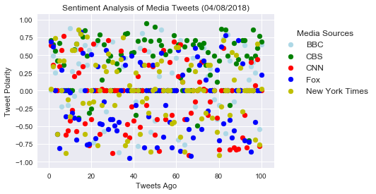
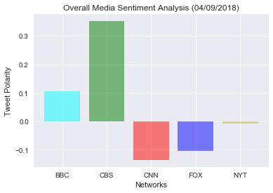

## Sentiment Analysis and Data Output

#### 1. CBS tends to have a more positive tweets than the other media sources analyzed
#### 2. According to VADER analysis, more negatively rated tweets tend to occur on Sunday afternoons (as of April 08 data)
#### 3. The overall average compound scores of the media sources from most positive to most negative are in the following order: CBS, BBC, NY Times, CNN, and Fox  

```python
# Import Dependencies
import json
import tweepy
import numpy as np
import matplotlib.pyplot as plt
import pandas as pd
import seaborn as sns
import time
```


```python
# Import and Initialize Sentiment Analyzer
from vaderSentiment.vaderSentiment import SentimentIntensityAnalyzer
analyzer = SentimentIntensityAnalyzer()
```


```python
# Import Twitter API Keys
from config import consumer_key, consumer_secret, access_token, access_token_secret
```


```python
# Setup Tweepy API Authentication
auth = tweepy.OAuthHandler(consumer_key, consumer_secret)
auth.set_access_token(access_token, access_token_secret)
api = tweepy.API(auth, parser=tweepy.parsers.JSONParser())
```


```python
# News Organization accounts
news_organizations = "@CNN", "@BBC", "@CBS", "@FoxNews", "@nytimes"

# Variables for holding sentiments and setting counter
sentiments = []
counter = 1

# Loop through tweets
for organization in news_organizations:
    tweet_number = 1

    # Get all tweets from home feed
    public_tweets = api.user_timeline(organization, count=100)

    # Loop through all tweets
    for tweet in public_tweets:
        print("Tweet %s: %s" % (counter, tweet["text"]))

        # Run Vader Analysis on each tweet
        compound = analyzer.polarity_scores(tweet["text"])["compound"]
        pos = analyzer.polarity_scores(tweet["text"])["pos"]
        neu = analyzer.polarity_scores(tweet["text"])["neu"]
        neg = analyzer.polarity_scores(tweet["text"])["neg"]
        tweets_ago = counter

        #Append into sentiment  
        sentiments.append({"Tweets Ago": tweet_number,
                          "Media Sources": organization,
                          "Text":tweet["text"],
                          "Date": tweet["created_at"],
                          "Compound": compound,
                          "Positive": pos,
                          "Neutral": neu,
                          "Negative": neg,
                           })
        tweet_number +=1
        counter +=1
```

    Tweet 1: New Trump adviser is "not much of a carrot man" https://t.co/Z53CxQc8cE | via @CNNopinion https://t.co/RRtck6hC7Z
    Tweet 2: "Fittest woman on earth" wins gold medal after family tragedy https://t.co/tn9oLryfxc https://t.co/oQe1NTxvTS
    Tweet 3: This 16-year-old from India won the 10-meter air pistol competition despite only picking up a pistol for the first… https://t.co/kOCqrBlxW5
    Tweet 4: Sebastian Vettel wins Bahrain Grand Prix after mechanic hit by Ferrari car https://t.co/Qb23kgLrJs https://t.co/BPZQKJj82e
    Tweet 5: Muenster van attack driver acted alone, police say https://t.co/P36RmkLlJf https://t.co/DLIIHURxvF
    Tweet 6: Seven US service members died in four noncombat-related air crashes in just four days, prompting concern over readi… https://t.co/hilVAfsHUW
    Tweet 7: Former Joint Chiefs chairman worries about generals in President Trump's White House https://t.co/v1RGxKgrRW https://t.co/dSptKGHJ06
    Tweet 8: The countries with the two biggest economies are threatening huge tariffs against one another as the world waits an… https://t.co/yHeTVzp95a
    Tweet 9: China has not wanted to 'talk in earnest,' top Trump economist says https://t.co/Qmb7XDtQfr https://t.co/v1ifOhkBln
    Tweet 10: "A Quiet Place" leads box office as horror keeps making noise https://t.co/LkY7pKca2u https://t.co/L68gDDrjUG
    Tweet 11: Republican Rep. Trey Gowdy, the House Oversight Committee chairman, accuses the Department of Justice of stonewalli… https://t.co/NrZl20tF4g
    Tweet 12: Patrick Reed has finished at 15-under-par 273 to win the Masters by one stroke over Rickie Fowler. It's his first m… https://t.co/XzQ0HJRjXv
    Tweet 13: "Fittest woman on earth" wins gold medal after family tragedy https://t.co/ggWpSE11Tc https://t.co/vkochjbLHE
    Tweet 14: A year after the US attacked Syria, what's changed? https://t.co/KLxFWSs77Y https://t.co/u0Vxpoyq4n
    Tweet 15: Inside the Houston House runoff that Democrats everywhere are watching https://t.co/MPyhLRhe4l https://t.co/OQQweUmA5V
    Tweet 16: Dozens have died in a possible gas attack in Syria https://t.co/zWdPqd4SXa https://t.co/IuyQqaQQvg
    Tweet 17: Body found in ocean near site of Hart family crash https://t.co/iMioXi2ikE https://t.co/0IBrFFI01v
    Tweet 18: "Scott is doing a great job!" President Trump defends embattled Environmental Protection Agency administrator Scott… https://t.co/AvNWuWPcmu
    Tweet 19: White House chief of staff John Kelly's influence in the White House is diminishing, The Washington Post reports… https://t.co/0mV0jbbeUT
    Tweet 20: Musician and National Rifle Association board member Ted Nugent likens Democrats, media, academics to "rabid coyote… https://t.co/Bjd7RA2vOj
    Tweet 21: Lightning strike kills 1, injures 4 in Florida https://t.co/EWeVc4RN27 https://t.co/oN64XlUtqB
    Tweet 22: Pilots had safety concerns months before NYC helicopter crash, lawyer says https://t.co/cdjCClnp82 https://t.co/3zyIYoHmMo
    Tweet 23: Polls open as Hungary's Euroskeptic leader Orban seeks fourth term https://t.co/4CL9j8UXkF https://t.co/M08G460BIC
    Tweet 24: "Saturday Night Live" returns to take shots at President Trump and Fox News https://t.co/SjH2wwaAfK https://t.co/a7ubQUY5kP
    Tweet 25: It's the great what if in political history. What if RFK’s political career had not been cut short by tragedy?… https://t.co/oeKAwpn78t
    Tweet 26: Cambridge Analytica whistleblower says data could've come from more than 87 million users and be stored in Russia… https://t.co/tKe0hZi5hH
    Tweet 27: Hockey community grieves after 15 killed in bus crash involving Canadian junior hockey team https://t.co/m79DKnL27v https://t.co/bCJwCQMwsw
    Tweet 28: Take a look at the week in politics https://t.co/gh3kvCmRB9 https://t.co/cq6Dbu1uLE
    Tweet 29: JPMorgan Chase and other big banks take center stage https://t.co/lnX1KxEvA0 https://t.co/hF7c1W2ihF
    Tweet 30: "Black Panther" passes "Titanic" at the box office https://t.co/8WgQH7sDJI https://t.co/xJA0PQLPe1
    Tweet 31: Equestrian Edwina Tops-Alexander returns from maternity leave with win in Miami Beach https://t.co/BQMOqCAmSb https://t.co/MAYLPz2CKi
    Tweet 32: Democratic Sens. Bernie Sanders and Kamala Harris crossed the base. What will it cost them? https://t.co/JCUtpuoRJ5… https://t.co/YQ6nurrcLd
    Tweet 33: Muenster van attack driver acted alone, police say https://t.co/Dixeqp0Lpb https://t.co/aEyRD34VPx
    Tweet 34: President Trump blames Russian President Vladimir Putin, former President Barack Obama for "Animal Assad," warns of… https://t.co/0w9dZwXcQK
    Tweet 35: Father confesses to killing 5-year-old son who had autism, authorities say https://t.co/w5R6G14JD6 https://t.co/0VCAHzrmig
    Tweet 36: President Trump slams Russian President Vladimir Putin and "Animal Assad" after suspected Syria chemical attack… https://t.co/DrbKX7gz5t
    Tweet 37: President Trump denies the influence of White House chief of staff John Kelly is diminished https://t.co/OH0GUq7pq7 https://t.co/ZuDJcbkuOO
    Tweet 38: Republican Sen. Susan Collins says embattled Environmental Protection Agency Administrator Scott Pruitt is "the wro… https://t.co/BopXBZjCxU
    Tweet 39: Trump's favorite tactic is criminalizing his critics, writes Julian Zelizer for @CNNOpinion https://t.co/JMmCSz9e60 https://t.co/C2004D24ML
    Tweet 40: No, Sean Hannity, Jimmy Kimmel is not at all like Harvey Weinstein, writes Dean Obeidallah for @CNNOpinion… https://t.co/nfQQeiP0Hy
    Tweet 41: President Trump's Department of Veterans Affairs pick says he's "got what it takes" to be secretary… https://t.co/ytbObnpZm9
    Tweet 42: Fiji wins Hong Kong Sevens for a record fourth time in a row https://t.co/dUKDw9DZwH https://t.co/KQwoe9o51e
    Tweet 43: Sinclair allows critical ad to air, sandwiched between its defense https://t.co/ycNHghvdZE https://t.co/XZEWcSb5kf
    Tweet 44: When an Oklahoma teacher revealed what the chairs in her classroom look like, she didn't imagine it would drive peo… https://t.co/ikq8yBNcWU
    Tweet 45: This is the first luxury hotel in space. You'll be able to visit in just four years — if you have $9.5 million to s… https://t.co/e1JO5SrGh4
    Tweet 46: This Oklahoma student is excited that her textbook was used by country singer @BlakeShelton in the 1980s. Her mothe… https://t.co/uH5ZescdFk
    Tweet 47: Sen. Susan Collins on EPA Administrator Scott Pruitt: “On policy grounds alone, I think Scott Pruitt is the wrong p… https://t.co/DuFfF6mrFq
    Tweet 48: He got cancer after decades of using talcum powder. Now a jury has awarded him $30 million in compensatory damages,… https://t.co/7CWKt6RkKL
    Tweet 49: Maine Sen. Susan Collins condemns apparent chemical weapons attack in Syria as “absolutely horrific” and asks Trump… https://t.co/5iHjZTJf1C
    Tweet 50: Kudlow explains Trump’s “original beef with Amazon”: “It’s not so much badmouthing … it’s lets have a level playing… https://t.co/WcCiRX71rw
    Tweet 51: WH economic adviser to farmers on tariffs: “This process may turn out to be very benign. You have to take certain r… https://t.co/7O0BxqQlKo
    Tweet 52: White House economic adviser Larry Kudlow: “The problem here is China, it is not President Trump … I think Presiden… https://t.co/5NpYOp9dl0
    Tweet 53: Virgin Galactic is one step closer to bringing tourists to space after this test flight https://t.co/ZCjzj9H641 https://t.co/hqDyPJBYKz
    Tweet 54: Marijuana legalization could help offset the opioid epidemic, studies find https://t.co/f1jCFl3HGY https://t.co/90konlBWXC
    Tweet 55: New York police released a video of this man pointing a metal object as if he were brandishing a gun. He was later… https://t.co/RdpOX0f7Bf
    Tweet 56: As Michigan ends a free bottled water program in Flint claiming the water quality has been restored, some residents… https://t.co/48752JJ6lI
    Tweet 57: In 2014, a 23-year-old woman with cerebral palsy was allegedly gang-raped and thrown from a rooftop.

    A Human Righ… https://t.co/nwXnAOx4li
    Tweet 58: Artificial intelligence scientists from around the world called for a boycott of a South Korean university over con… https://t.co/wP8NBtLTjL
    Tweet 59: The mystery of a 4,000-year-old ancient Egyptian mummy's head has finally been solved, after the FBI successfully e… https://t.co/qfBv16K5sy
    Tweet 60: This police officer in Chattanooga, Tennessee, took a break from hiding Easter eggs at an event for the holiday to… https://t.co/683SMmiCdD
    Tweet 61: If you stand inside the world's quietest room for long enough, you start to hear your heartbeat. Then you lose your… https://t.co/cZgV29U4xN
    Tweet 62: This 17-year-old student got accepted into 19 top universities, including Yale, Stanford, Columbia and the London S… https://t.co/gDxO5FWZY4
    Tweet 63: An Illinois town has banned assault weapons. The penalty if you keep one? Up to $1,000 a day.… https://t.co/VPuj79hbh0
    Tweet 64: The companies Trump has attacked on Twitter since his election:

    ABC News
    Amazon
    Boeing
    CBS
    CNN
    Comcast/MSNBC/NBC
    D… https://t.co/HDISsZZEuX
    Tweet 65: A former city official in Georgia used the N-word while pushing for Confederate History Month at a city meeting… https://t.co/YnchpYURJg
    Tweet 66: Nancy Pelosi, the top House Democrat, calls on EPA Administrator Scott Pruitt to resign https://t.co/V63jZLv5se https://t.co/RVYRvwKsyL
    Tweet 67: Virgin Galactic is one step closer to bringing tourists to space after this test flight https://t.co/4b6rOLtWsS https://t.co/x1zoTTWtEh
    Tweet 68: Mexican President to Trump: "Nothing and no one stands above the dignity of Mexico." https://t.co/2C5VVONFAk https://t.co/EqIotPJCxq
    Tweet 69: President Trump has begun informally preparing for a possible interview with special counsel Robert Mueller, source… https://t.co/aouH83OnCf
    Tweet 70: Pilots had safety concerns months before NYC helicopter crash, lawyer says https://t.co/zm5dsd8kkG
    Tweet 71: This mom donated 14 gallons of breast milk to NICU babies in need https://t.co/HwjS6NbWpC https://t.co/znmKGN6Vip
    Tweet 72: New York police released a video of this man pointing a metal object as if he were brandishing a gun. He was later… https://t.co/gX9AgMmcvN
    Tweet 73: Nancy Pelosi, the top House Democrat, calls on EPA Administrator Scott Pruitt to resign https://t.co/4bmqCRET97 https://t.co/YmBqxJZYsZ
    Tweet 74: Shoe retailer Nine West files for bankruptcy after reporting it owes more than $1 billion https://t.co/D0YCZ9rjtD https://t.co/Uvkg4jybam
    Tweet 75: A former city official in Georgia used the N-word while pushing for Confederate History Month at a city meeting… https://t.co/CbYMeNh1qp
    Tweet 76: Cuomo-Nixon fight could divide NY Dems beyond primary https://t.co/FJuiDy6vGf https://t.co/GXpUKUcQ4W
    Tweet 77: A woman was killed and four other people were injured by a lightning strike in White Springs, Florida, the sheriff'… https://t.co/dzwyUnr63W
    Tweet 78: Border Patrol has thousands of openings it can't fill https://t.co/lhQhOdM7Bj https://t.co/cRvKZ8LNkc
    Tweet 79: Liberia's promising future is a symbol of international solidarity https://t.co/6Z4IlSeZH9 https://t.co/Mcvi60z9p1
    Tweet 80: Golfer Patrick Reed will take a three-shot lead into the final round of the Masters as a pair of eagles on the back… https://t.co/3yvPKGeBMr
    Tweet 81: Brazil's ex-President Lula da Silva to surrender to federal police https://t.co/RRnB5UVjXK https://t.co/xB5lFHHwuO
    Tweet 82: At least one person has died in the fire at Trump Tower in New York. Four firefighters were injured, officials say.… https://t.co/MRnE1kYFT9
    Tweet 83: "These kids that had the blood of their 17 classmates splattered on their clothes ... were baptized into a real mov… https://t.co/NkM8YIF8Ni
    Tweet 84: The body of a female was found in the immediate vicinity of a crash in California that killed at least 5 members of… https://t.co/HGuaeTUhWA
    Tweet 85: “We talked about death all the time … he’d say, 'death is the ultimate democracy. Everybody has got to die'”: Civil… https://t.co/x6RwelBh72
    Tweet 86: Several Syrian activist groups say a toxic gas attack killed dozens of people in Ghouta. The Syrian regime says it'… https://t.co/rsqaEjmnGL
    Tweet 87: 'Black Panther' was “always” going to tackle “political issues head on,” says the film’s director, Ryan Coogler… https://t.co/ey8JNVnON7
    Tweet 88: "Our democracy was hacked before Vladimir Putin ... it was hacked by big money," former Vice President Al Gore tell… https://t.co/ikSaN8SnQe
    Tweet 89: Al Gore tells @VanJones68 that President Trump "ought to fire" Environmental Protection Agency administrator Scott… https://t.co/0cAw6kPtD6
    Tweet 90: RT @cnnbrk: 1 person was seriously injured in a four-alarm fire at Trump Tower, the New York City Fire Department says https://t.co/VbhJoIL…
    Tweet 91: Roger Stone, a longtime associate of President Trump, claimed to know of WikiLeaks email release date, despite sayi… https://t.co/SR0x1MnEAF
    Tweet 92: "I would bet on American democracy surviving this bleak period, for sure, but the challenge is stiffer than any we'… https://t.co/ll50N03cIC
    Tweet 93: President Trump defends tariffs amid jittery markets https://t.co/lUIz1ErTrK https://t.co/HcjlVpNaUP
    Tweet 94: President Trump criticizes the FBI and Justice Department, asking what they "have to hide" https://t.co/epRv6UsJHF https://t.co/uidS6CVy2c
    Tweet 95: He faced an impossible decision. But were Pope Pius XII’s actions during WWII worthy of sainthood? #Pope tomorrow a… https://t.co/BprHdexTGc
    Tweet 96: With 16 service members killed in air crashes, top lawmaker says "readiness of the military is at a crisis point"… https://t.co/ujzu7leTHg
    Tweet 97: Democrats call for investigations into Interior Secretary Ryan Zinke, National Park Service https://t.co/YwUw7VbDbu https://t.co/UhFqSF7NMS
    Tweet 98: New proposal wouldn't impact endangered species currently protected https://t.co/axiXqHcG5G https://t.co/aaG7SefcxN
    Tweet 99: VA dismisses privatization talk after leadership change https://t.co/DJglkb8ig8 https://t.co/S3ah2noKY8
    Tweet 100: 2 dead after delivery vehicle hits crowd in German city of Muenster https://t.co/8cjUNOM4dy https://t.co/KoUtKbldAK
    Tweet 101: 😺💦 This is Maya the jaguar's very first swim!  
    #BigCatsAboutTheHouse https://t.co/IacZP3ltf3
    Tweet 102: 😂 Need a hand getting the kids to bed? https://t.co/JAUkyoVSA8
    Tweet 103: 'Silencing masks' and 'wife auctions': What life used to be like for women.
    👉 https://t.co/7Z1bcXKgOx https://t.co/gzm7Hf3loH
    Tweet 104: 🦖😂 Philomena Cunk examines the barbaric conditions in which we keep today's dinosaurs.
    #CunkOnBritain  https://t.co/nBav5dqh7a
    Tweet 105: RT @bbcgetinspired: Meet Sue...

    She is planning to run the 2018 @LondonMarathon to prove someone with vascular dementia can do it. 🙌

    ➡ ht…
    Tweet 106: 🎨 Victoria Lomasko is a Russian graphic artist who's travelled up and down her country painting 'forgotten women'. https://t.co/XtlpBlAYb0
    Tweet 107: 🎶 The search for the next Young Musician has begun, and the first @BBCYoungMus semi-finalist of 2018 has been confi… https://t.co/klUA4GWtb0
    Tweet 108: 'If boys are getting diagnosed with autism, girls need exactly the same.' https://t.co/f7Aft0LWwB
    Tweet 109: 💃🕺 Meet the kids cutting some serious shapes on the streets of Lagos. https://t.co/3ySZPqua01
    Tweet 110: RT @BBCSport: What a nice surprise 😍💍

    Two of @TeamEngland 's basketball players got engaged on court at the Commonwealths.

    Congrats @Jam…
    Tweet 111: 😂 'Surprise me'. https://t.co/Jo7illTafh
    Tweet 112: When doctors found a large tumour on little Poppy’s brain, her parents faced one of the toughest decisions of their… https://t.co/MGM0dpxlFH
    Tweet 113: RT @BBCSport: Beauty queen ✅
    Commonwealth Games weightlifting silver medallist ✅

    Introducing Sarah Davies...

    #GC2018 #bbcgoldcoast https:…
    Tweet 114: From Ordeal by Innocence to the return of The Handmaid’s Tale, here are @BBC_Culture's pick of programmes to watch… https://t.co/Q6S34uv5LX
    Tweet 115: 🦍💬 Not only can Koko the gorilla use sign language, she also appears to have learnt to lie...

    https://t.co/xXZwlLDLJh
    Tweet 116: RT @BBCOne: .@johnkrasinski's got MOVES. #TheGrahamNortonShow #TGNS https://t.co/2HUMM0ixEW
    Tweet 117: Football, volleyball AND martial arts? ️⚽️🥋🤔

    Sepak Takraw is the best sport you've never heard of...

    https://t.co/ngTwJHEmrI
    Tweet 118: 🐳 Meet the gargantuan air freighter that looks like a whale. https://t.co/7DPUt8okKU
    Tweet 119: ❤️🎶 @NiallOfficial's Live Lounge cover of @JuliaMichaels' Issues is just perfect.  https://t.co/XpsnR29hPU
    Tweet 120: RT @CBeebiesHQ: Goodnight @ChrisEvans,🌙

    Chris reads Goodnight Goodnight Construction site tonight. 🏗️

    #BedtimeStory is at 6:50pm 😴💤 htt…
    Tweet 121: 🦁😢 Lions are often poisoned to prevent them attacking livestock. https://t.co/254nhtlMW5
    Tweet 122: 😲 Some VERY impressive maths here.
    #UniversityChallenge https://t.co/crvQQ5V3Vn
    Tweet 123: Doctors are finding one way that sugar can benefit your health - it may help heal wounds resistant to antibiotics.… https://t.co/zI9pN0zSVo
    Tweet 124: RT @BBCRadio2: "The clunk of putting the cassette in, snapping it shut... oh wait I'm going to rewind to get to the start of the song. It's…
    Tweet 125: 🌎📸 Our pick of the most striking news photographs taken around the world recently.
    👉 https://t.co/zPpuZq9hOC https://t.co/fYUTrG44Ra
    Tweet 126: How did this new mum survive in the chaos that followed Hurricane Maria? https://t.co/Nx7uFz1k56
    Tweet 127: For Dr Joel Salinas, music creates colours, numbers have personalities and another person's pain feels almost like… https://t.co/lrGhiKBaGZ
    Tweet 128: RT @bbcthree: 94-year-old Judo Jack says: "Get off your butt and do something." https://t.co/M9CzCtwSqe
    Tweet 129: RT @BBCR1: It's been one whole year of Sign Of The Times and we need to know whether @Harry_Styles finally let Chris Martin be head of his…
    Tweet 130: What an inspiration! 💪

    ❤️ Fraser shed the pounds to pursue his wrestling dream, in memory of his mother. https://t.co/LWmuGo6dTN
    Tweet 131: RT @BBCSport: It's a historic victory for Uganda! 🙌

    Earlier today they recorded their first ever victory at the Commonwealth games with a…
    Tweet 132: 🍓🍒 Did you know that cherries and strawberries represented the souls of men? Or that a dragonfly could be the devil… https://t.co/s9rFhv5wlu
    Tweet 133: Losing your hair whilst going through cancer treatment can be distressing.

    This shop decided to try and do someth… https://t.co/mcOgFrRtdq
    Tweet 134: 🗑🤖 This trash collecting robot can be controlled by anyone via the internet. https://t.co/N2gbeP2nIo
    Tweet 135: RT @bbcgetinspired: 'Women don't just stay at home and look after the kids, we don't just do dance or gymnastics, we play tennis, football…
    Tweet 136: 😍🐿 These baby red squirrels are too cute to handle. https://t.co/d2r7c8EyUh
    Tweet 137: RT @bbcmusic: Jade, this was INCREDIBLE 😍
    #SoundsLikeFridayNight https://t.co/rSGnYVTFYu
    Tweet 138: 🤔 Modern life is a mystery. https://t.co/a4817Iugzz
    Tweet 139: Tune in to #SLFN tonight for performances from @snowpatrol, @Meghan_Trainor, @yearsandyears and @halsey. 🎶🎤🎉

    Sound… https://t.co/EFjiBk5upm
    Tweet 140: RT @bbcpointswest: 🤩 Prince Harry and Meghan Markle arrive in Bath for the Invictus Games trials 🤩 https://t.co/ywlHvaHt2z
    Tweet 141: 😂 If you're going to get dumped on TV, it might as well be via @KylieMinogue.

    #TheGNShow | 10.35pm | @BBCOne https://t.co/CgfsjKjeob
    Tweet 142: RT @BBCNewsround: Ever wondered why we cry when we chop onions? Now you'll have no excuse to avoid cooking dinner, sorry! 😂https://t.co/SyX…
    Tweet 143: RT @BBCOne: MY OLD FRIEND.

    #OrdealByInnocence #Sunshine https://t.co/vQBvcgLrCe
    Tweet 144: 🎻 Two years ago @ShekuKM won @BBCYoungMus.
    Now he wants to inspire other young people to pick up an instrument too… https://t.co/fG0F3x2eDN
    Tweet 145: RT @bbcgetinspired: She's only 11 years old, but @sport_wales' Anna Hursey is smashing it at #GC2018! 🙌

    ➡ https://t.co/9sFYGzsgnQ #GetIns…
    Tweet 146: RT @bbcmusic: Counting down the seconds TBH 💅@LittleMix https://t.co/6UTrz9gqQr
    Tweet 147: 🍞🍻 Hate food waste but love beer? https://t.co/IL9jmlaMjs
    Tweet 148: RT @BBCRadio3: "Stop being so selfish – this isn’t about you." Harsh words - or tough love?
    Zeynep, Jess and Sam discuss one teacher’s cont…
    Tweet 149: 🐘 🦏🦒🔭
    Saving animals using space technology. https://t.co/gAwJcD2I2A
    Tweet 150: 🍿🎟 From a near-silent horror film to an Australian Western, here are 8 movies worth watching in April.
    👉… https://t.co/b15kbsQ7MD
    Tweet 151: RT @BBCOne: For all the drama queens. 👑 https://t.co/RfdMDieaCZ
    Tweet 152: 💃🕺 Meet the dancers from Lagos who've been tipped for the top by @Rihanna and @NaomiCampbell. https://t.co/3ySZPqcyBr
    Tweet 153: RT @BBCSport: Gareth Evans absolutely loved it! 💪

    This is how it felt to win Wales' first gold! 🥇🏴󠁧󠁢󠁷󠁬󠁳󠁿

    #GC2018 #bbcgoldcoast https://t…
    Tweet 154: 🦁🦏🐆
    Royal pets are now more synonymous with corgis than wild animals, but historically monarchs would own an array… https://t.co/5VVyiWHPv1
    Tweet 155: 😻 Say hello to Willow the cheetah!
    #BigCatsAboutTheHouse https://t.co/e9xNVjR0gi
    Tweet 156: RT @BBCSport: It all happened in the weightlifting... #GC2018 https://t.co/s8qnPsuyaz
    Tweet 157: RT @BBCBreakfast: All you need to know about the 'sugar tax' and how your favourite soft drink may change. https://t.co/mjFwTN1UHs
    Tweet 158: RT @bbcpress: 📸 #FirstLook at Eleanor Tomlinson and Rafe Spall in @BBCOne adaptation of H.G. Wells' #WarOfTheWorlds as filming begins: http…
    Tweet 159: 😲🎨🇿🇦 Hotel or modern art museum?
    #AmazingHotels https://t.co/Xbmjzviivh
    Tweet 160: It might not always feel like it, but psychologist @sapinker is convinced that the world is on the up. https://t.co/a8PrDXjDcL
    Tweet 161: 'There’s the England before Stephen, and there’s the England after Stephen.'

    Stephen: The Murder That Changed a N… https://t.co/BLynBXYH7I
    Tweet 162: 🐆 Could building walkways in nature help save these big cats?
    #BigCatsAboutTheHouse https://t.co/NdkxCDBpee
    Tweet 163: 😋😋 Pocket-friendly recipes for two.
    👉 https://t.co/CzuDNQNw3B https://t.co/xbrrmlIgNF
    Tweet 164: 👀 From illegal ivory to taxidermy, take a peek inside the banned wildlife room at Heathrow Airport. https://t.co/8yIok0eobX
    Tweet 165: RT @bbccomedy: Smithy is an irl ray of #sunshine. https://t.co/NgA4t4jZob
    Tweet 166: RT @BBCTheOneShow: ..@DIYSOS  are building a gym and community area for the Grenfell community, but @MrNickKnowles needs something specific…
    Tweet 167: RT @bbcmusic: STOP EVERYTHING: @GaryBarlow is coming to Sounds Like Friday Night 🙌💪
    Don't miss it: 7.30pm, Friday, @BBCOne 💫#SLFN https://…
    Tweet 168: RT @BBCOne: You took your sweet time.

    #Poldark #sunshine https://t.co/Ep33Zt5YZi
    Tweet 169: It's time society stopped judging black women by their hair, British-Somali artist @blackpowerpufff says.… https://t.co/lRmAfxmefR
    Tweet 170: 📚 A biography about conjoined twins from Siam who became US slave-owners + 9 other books to bury your nose in this… https://t.co/1UfP6LTH0i
    Tweet 171: RT @BBCSport: Scotland's Hannah Miley takes the silver in the women's 400m individual medley! 🥈 https://t.co/GrailyYrno #bbcgoldcoast https…
    Tweet 172: 😍🐿 A trio of baby red squirrels have been rescued in Perthshire.  https://t.co/d2r7c8EyUh
    Tweet 173: RT @BBCBreakfast: Some GOOD plastic news!
    Marine conservationists say the 5p carrier bag charge has reduced the amount of single use plasti…
    Tweet 174: RT @BBCRadio2: What happens when you put one harp, three fiddles, and the cream of the folk world in one room?

    We brought together @elizac…
    Tweet 175: RT @BBCRadio4: Is @Youtube a form of folk art?
    The #Unpopped podcast looks at the rise and dominance of YouTube and YouTubers with @sophieh…
    Tweet 176: RT @bbcasiannetwork: 🚫It's your last chance to apply for placements at @BBCR1 @1Xtra and Asian Network in our Where It Begins Scheme! 🚫
    Wha…
    Tweet 177: RT @bbcthree: "Let me guess, your name is Singh?" and other things not to say to Sikh people. https://t.co/tZLfWssxez
    Tweet 178: RT @BBCSport: It was a tough day in the office for this Cypriot gymnast.

    #bbcgoldcoast #GC2018 https://t.co/Xmt9bgMyeQ
    Tweet 179: RT @bbcweather: *Public service announcement*
    Ladies and gentlemen DO NOT be alarmed! I've checked through our 'big book of weather', and I…
    Tweet 180: 🐐 No kidding, goat pilates is a real thing. https://t.co/kmuOKupPwB
    Tweet 181: RT @BBCNewsEnts: Florence + The Machine, @DemiLovato @BastilleDan and @QueensChristine have been added to the line-up for @BBCMusic's Bigge…
    Tweet 182: 🎨🌆 Monet in the city: A rarely-seen side of the great Impressionist.
    👉https://t.co/IFaHpevPfG https://t.co/E9UwhYfz32
    Tweet 183: Doctor Kathryn Mannix on why we need to talk about death. https://t.co/TlFgCB78Lm
    Tweet 184: Tonight, @PatricKielty explores the legacy of Northern Ireland's peace deal, 20 years on.

    My Dad, the Peace Deal… https://t.co/5xNLeIgiUM
    Tweet 185: This 83-year-old lingerie model has a powerful message about ageing. https://t.co/F0p12gFvFu
    Tweet 186: RT @BBC6Music: 😍 Make a date with Cillian Murphy this Friday from 7-9pm BST as he sits in for @IggyPop. Listen worldwide https://t.co/Dd2ji…
    Tweet 187: Don’t miss the highlights of the #CommonwealthGames Opening Ceremony from Australia’s Gold Coast.  🏸🏊‍♀️🤸 #GC2018… https://t.co/krMnULo1NJ
    Tweet 188: Does your name match your face? https://t.co/N2kzChM8dc
    Tweet 189: Animal cloning is becoming more common – and cloning extinct species could be on the horizon.

    Could parks and zoo… https://t.co/WKRdKGZiQE
    Tweet 190: 🍕😂 A Canadian man has been 'pardoned' by a luxury hotel after his room was ransacked by a flock of pepperoni-loving… https://t.co/TvU39MT9pl
    Tweet 191: RT @BBCYoungMus: The search for the next #bbcyoungmusician begins this Friday with 5 incredible strings finalists@BBCFOUR,7.30. Missed our…
    Tweet 192: 🚨😱 Who's excited to see @LittleMix on Sounds Like Friday Night!?

    #SLFN | @BBCOne | Friday, 7.30pm https://t.co/474h2EwXjv
    Tweet 193: RT @BBCWomansHour: Today #MayaAngelou would have turned 90 🎈 Poet, director, ambassador, actor and civil-rights activist were just a few of…
    Tweet 194: You can't be 'a bit OCD'.

    Challenging some of the common misconceptions about #OCD. https://t.co/nGIf4mMJc4
    Tweet 195: The Games are here. But how much do you really know about the Commonwealth?
    Play our quiz to find out.
    👉… https://t.co/tQeekDEvWo
    Tweet 196: RT @BBCArchive: Dr Martin Luther King speaking with John Freeman on Face to Face.
    You can watch the interview in full here: https://t.co/BX…
    Tweet 197: RT @VictoriaLIVE: "How will the dream live on in me, in you, in all of us?"

    @Oprah Winfrey pays tribute to the civil rights leader Dr Mart…
    Tweet 198: RT @bbcthesocial: You're never too old for a selfie ❤️

    @Antonis95K https://t.co/VHihA5XOrY
    Tweet 199: 😁😂 A police force's e-fit of a burglary suspect has been mocked for its resemblance to the Cheshire Cat.
    👉… https://t.co/VdkfuAmiFI
    Tweet 200: 🧠🎶 There's a good reason why this woman was asked to play the flute during brain surgery.  https://t.co/I5FpONxP4f
    Tweet 201: @OldDominion's Matthew Ramsey is here with a friendly reminder - Country Music’s Party Of The Year® is just seven d… https://t.co/SFnXxQLoPN
    Tweet 202: It's time to celebrate! @MomCBS will be back back for Season 6! https://t.co/ianxp6JWHq
    Tweet 203: It all comes down to this! Stream Round 4 of #TheMasters Tournament on CBS live with a free trial of CBS All Access… https://t.co/mNFSAUkLvZ
    Tweet 204: @reba is ready for her hosting duties! In just one week, watch her take the stage at the 53rd #ACMawards. Tune in A… https://t.co/TmjezmqPme
    Tweet 205: Watch some of the biggest names in golf compete in one of the greatest tournaments of the year! Stream #TheMasters… https://t.co/e8kbkSLx5k
    Tweet 206: Tonight's the night! Here's a behind-the-scenes look at season 2 of @RansomCBS before the big premiere. Tune in at… https://t.co/WtRHvufO7H
    Tweet 207: What song will @DierksBentley belt out when he takes the stage to perform at the 53rd #ACMawards? Get ready to sing… https://t.co/oEtKJnKQVn
    Tweet 208: @johnlegend, @mirandalambert, @KeshaRose, and more perform @eltonofficial's hit songs! Watch Elton John: I'm Still… https://t.co/VF3hf8OCT7
    Tweet 209: Ask 53rd ACM Awards® host @reba a question and she just may answer it on April 11 at 5:30p ET/2:30p PT when she tak… https://t.co/DAa5gQS8oX
    Tweet 210: What’s @eltonofficial's birth name and which of his songs holds the record for biggest selling single of all time?… https://t.co/N5qkMYCE7e
    Tweet 211: Do you have a question for country music legend and host of the 53rd ACM Awards® @reba? Write it below for a chance… https://t.co/yVVDVFpxDM
    Tweet 212: How well do you know The Academy of Country Music Awards™? Test your knowledge of Country Music’s Party of the Year… https://t.co/lfWAcvAbZa
    Tweet 213: RT @CodeBlackCBS: The intensity and emotions of your favorite show are returning to @CBS in 3 weeks.

    Get excited. https://t.co/aGUNIPwRjh
    Tweet 214: Don't miss @littlebigtown's amazing performance of @eltonofficial's "Rocket Man" under the big spotlight at Elton J… https://t.co/bqse7nhkV3
    Tweet 215: Today's biggest stars are celebrating @EltonJohn's most beloved and legendary catalogue of hits with two albums dro… https://t.co/cilUdkKtjQ
    Tweet 216: RT @LifeInPiecesCBS: We "literally can't even" with how hilarious these #LifeInPieces outtakes are! 😂

    Introducing Laughing To Pieces! Foll…
    Tweet 217: RT @YoungSheldon: Don't miss guest star @Followtheblonde in tomorrow's all-new #YoungSheldon! Trust us, you're going to love every minute.…
    Tweet 218: RT @MomCBS: Tomorrow's episode of #Mom is going to be a doggone good one! https://t.co/e1WI3uOxVg
    Tweet 219: RT @survivorcbs: There's a lot at stake when competing for actual steak. Get a glimpse at an all-new #Survivor: Ghost Island at 8/7c on CBS…
    Tweet 220: RT @TVLine: #LifeInPieces Sneak Peek: Sophia and Her Stuffed Toys Stage a Musical Protest https://t.co/r16SLZlZPc
    Tweet 221: Whose catchy tune will take Song Of The Year at the 53rd #ACMawards? Give it up for the four nominees -… https://t.co/R9MtUNZtsw
    Tweet 222: Here's everything you need to know before tuning into Elton John: I'm Still Standing - A GRAMMY® Salute on Tuesday,… https://t.co/C8fiKl4j98
    Tweet 223: In just one week, @eltonofficial and today's hottest stars in music will join together to celebrate Elton's countle… https://t.co/ACQGHNWz8u
    Tweet 224: Tonight we #LightItUpBlue for greater understanding and acceptance. CBS supports #WorldAutismAwarenessDay by lighti… https://t.co/hBAXcDvP4r
    Tweet 225: No one does it quite like @eltonofficial. The artist himself will belt out some of his chart-topping hits on Elton… https://t.co/ckY4bUvTXI
    Tweet 226: The Las Vegas strip is about to light up brighter than ever before when Country Music’s Party Of The Year® takes ov… https://t.co/j1A2ZVHAoO
    Tweet 227: “If you don’t do something about it, then who are you? … It can happen to anyone.” - @aplusk

    Tonight at 10/9c, a… https://t.co/EQabNc1UZI
    Tweet 228: Give it up for @KelseaBallerini! This star is one of the Female Vocalist Of The Year nominees and she's ready to ta… https://t.co/wLyHwkEGs2
    Tweet 229: Take and post a photo of the woman in your life who inspires you! The photo should only have one person against a n… https://t.co/BHdxXlWfKP
    Tweet 230: Expect epic performances by @kanebrown , @kelly_clarkson, @OfficialJackson, and more at this year's 53rd #ACMawards… https://t.co/3yso7Z0cjv
    Tweet 231: Will @HIGHVALLEY, @LancoMusic, @LOCASHmusic, @MidlandOfficial, or @runawayjune be named New Vocal Duo Or Group Of T… https://t.co/v0QIPLC47R
    Tweet 232: Count on Entertainer Of The Year nominee @LukeBryanOnline to crash the party with an epic performance at the 53rd… https://t.co/27ua60HTqu
    Tweet 233: Join @eltonofficial and some of today's hottest names in music when they take the stage to perform his most memorab… https://t.co/jz0jaShZIj
    Tweet 234: RT @ACMawards: The ACM for New Vocal Group of the Year goes to @MidlandOfficial! And yes, that really was @Reba on the phone! #ACMawards ht…
    Tweet 235: RT @ACMawards: In case you didn’t know, the ACM for New Male Vocalist of the Year goes to @BrettYoungMusic. Check out his reaction when @Re…
    Tweet 236: RT @ACMawards: Over the weekend @Reba called the ACM New Artist of the Year winners to let them know they had won! Let’s just say our New F…
    Tweet 237: Congratulations to the 53rd #ACMawards New Artist winners @Lauren_Alaina, @MidlandOfficial, and @BrettYoungMusic! W… https://t.co/Fr8H4arwGj
    Tweet 238: New start times in East/Central Time Zones #60Minutes 7:35ET/6:35CT #Instinct  8:35ET/7:35CT #NCISLA 9:35ET/8:35CT… https://t.co/8W5hAeLrvs
    Tweet 239: Don’t miss a minute of the action. Stream the Elite Eight® games LIVE today starting at 2PM ET with a FREE trial of… https://t.co/8NwU8HdiHR
    Tweet 240: RT @MomCBS: That's a wrap on the #Mom panel at #PaleyFest! Thanks for following along! https://t.co/we4JgqPt6P
    Tweet 241: RT @MomCBS: A fan just commented that #Mom helped bring him out of a deep depression. 💜💜💜 #PaleyFest
    Tweet 242: RT @MomCBS: "Go out for it anyway. If you're good for the role, you're good for the role." @theJaimePressly's advice for aspiring actors wi…
    Tweet 243: RT @MomCBS: Mom Co-Creator @GemmaRBaker just pointed out her own #Mom in the audience at #PaleyFest! 💜
    Tweet 244: RT @MomCBS: "I'm not someone in recovery who goes to AA, but I have taken so much away from it...to take one day at a time." - @theJaimePre…
    Tweet 245: RT @MomCBS: "You get to appreciate working with such talented people." - @AnnaKFaris #Mom #PaleyFest
    Tweet 246: RT @MomCBS: “I love this job. I love working with these women. I love working in front of the live audience… It’s alive and it’s fun.” - @A…
    Tweet 247: Get on your feet for @Jason_Aldean, @ThomasRhett, @ChrisStapleton, @KeithUrban, and @ChrisYoungMusic, the five nomi… https://t.co/oT5ogjdj4x
    Tweet 248: Get ready for some sweet games! Stream #5 Clemson vs #1 Kansas LIVE at 7PM ET and #11 Syracuse vs #2 Duke LIVE at 9… https://t.co/4WstgrKNnW
    Tweet 249: RT @SEALTeamCBS: In honor of #NationalPuppyDay... 😍 #SEALTeam https://t.co/4mIZPpiRlU
    Tweet 250: RT @HawaiiFive0CBS: Nothing like a man and his dog! 😍🐶 Happy #NationalPuppyDay to Eddie, the best pup on the Five-0 Task Force! #H50 https:…
    Tweet 251: Game on! 16 teams left and the race to the finish continues tonight. Stream #11 Loyola-Chicago vs #7 Nevada LIVE at… https://t.co/W374rmzzoC
    Tweet 252: Save the date! These are season finales you do NOT want to miss. RT if you're excited! https://t.co/UUQoWsPPSh https://t.co/cDl4WmxMtU
    Tweet 253: Congratulations to all of the @CBSDaytime nominees for the #DaytimeEmmys! See the full list of #DaytimeEmmy nominee… https://t.co/ivJVJWvfsf
    Tweet 254: Female Vocalist Of The Year nominee @MarenMorris will show her fans how it’s done when she takes the stage to showc… https://t.co/PITjmAoFT8
    Tweet 255: The legendary @Reba returns to host the 53rd #ACMawards and she’s proving just how comfortable she is behind the mi… https://t.co/XPXcSPRXqC
    Tweet 256: RT @nancyodell: Told my daughter I'd be presenting at @ACMawards again this year. (Woot woot!We both luv country music!)She took this pic o…
    Tweet 257: RT @ladyantebellum: Ecstatic to announce we'll be performing at the #ACMawards in Las Vegas again this year! https://t.co/Qfhs94j6FR
    Tweet 258: Country superstars @kennychesney, @ladyantebellum, @blakeshelton, and @KeithUrban have just been added to the stell… https://t.co/bJ4If7MacP
    Tweet 259: RT @YandR_CBS: Forever evolving, Forever inspiring, Forever Young and Restless. ❤️ Get ready to celebrate 45 years of #YR starting in just…
    Tweet 260: New start times in East/Central Time Zones: #60Minutes 7:37ET/6:37CT #Instinct series premiere 8:37ET/7:37CT… https://t.co/xT3YKqmu2M
    Tweet 261: Spend your Sunday streaming Second Round games LIVE with a FREE trial of CBS All Access! https://t.co/3P85rXLy4b https://t.co/zbWfirD9Ju
    Tweet 262: RT @instinctcbs: TONIGHT, Dr. Dylan Reinhart rewrites the book on abnormal behavior. Don't miss the premiere of #Instinct at 8/7c! https://…
    Tweet 263: If any duo knows how to rock the stage, it's @FLAGALine. The Vocal Duo Of The Year nominee will perform live at the… https://t.co/FknabB8NQp
    Tweet 264: How is your bracket looking after last night? Stream Second Round games LIVE today with a FREE trial of CBS All Acc… https://t.co/25JlIpgwog
    Tweet 265: Where better to spend #StPatricksDay than the place everybody knows your name? It’s just your luck that every singl… https://t.co/Fom5wmdENL
    Tweet 266: Stars @JakeMcDorman and Nik Dodani will join the cast in the upcoming revival of Murphy Brown coming to CBS.… https://t.co/JCAx29lo0i
    Tweet 267: RT @thegoodfight: Go behind the scenes with costume designer @DanLawsonStyle in "Behind The Style," a new weekly video series all about the…
    Tweet 268: The games have just begun! Continue to stream First Round games LIVE today with a FREE trial of CBS All Access:… https://t.co/YTGsJ48zYP
    Tweet 269: RT @TheTalkCBS: You asked, we answered! The fun never ends when the ladies #KeepTalking and answer your fan questions 🗣💬➡️ https://t.co/ie1…
    Tweet 270: RT @instinctcbs: Dr. Dylan Reinhart is lured back into the field from his life of quiet academia when a certain serial killer makes things…
    Tweet 271: Stream First Round games LIVE today starting at 12PM ET with a FREE trial of CBS All Access! https://t.co/3P85rXLy4b https://t.co/vZow3YD8cb
    Tweet 272: RT @CBSSports: It's the most wonderful time of the year. #MarchMadness https://t.co/e4c9qohqSR
    Tweet 273: Give these ladies some love! @Lauren_Alaina, @DBradbery, @carlypearce, and @RaeLynn are nominated for New Female Vo… https://t.co/IVhwURfJ3S
    Tweet 274: RT @ManWithAPlan: Hungry for more #ManWithAPlan bloopers and behind-the-scenes videos featuring cast like @matt_leblanc, @thelizasnyder, @k…
    Tweet 275: Music stars @MileyCyrus, @edsheeran, @ladygaga, and more will honor the legendary @eltonofficial and his hit songs… https://t.co/UzxARCCLnI
    Tweet 276: RT @thegoodfight: The verdict is in. The new season of #TheGoodFight is 🔥🔥🔥! Stream it now on CBS All Access: https://t.co/FkYSNSXlRb https…
    Tweet 277: RT @MadamSecretary: In less than an hour, #MadamSecretary's Keith Carradine will be taking over the @MadamSecretary Twitter page! Tweet alo…
    Tweet 278: RT @DierksBentley: Take and post a photo of the woman in your life who inspires you daily! Use the hashtag #WomanAmenACM in your post for a…
    Tweet 279: RT @MomCBS: If you missed guest star @KChenoweth in the latest episode of #Mom, not to worry! Watch now: https://t.co/RlvXoGOZ0l https://t.…
    Tweet 280: Give a round of applause to @KelseaBallerini, @MirandaLambert, @Reba, @MarenMorris, and @CarrieUnderwood, the five… https://t.co/Ncp1BTXx6N
    Tweet 281: RT @thegoodfight: Smart, sexy, and sophisticated. See what's coming this season on #TheGoodFight. https://t.co/CuKhx2G50P https://t.co/ygTI…
    Tweet 282: RT @BlueBloods_CBS: Even stand-up guys fall down sometimes. #BlueBloods is new tonight at 10/9c! https://t.co/UOlDm22wWW
    Tweet 283: Today and every day we celebrate the women in our lives who empower and inspire us. Share a story about an influent… https://t.co/9rVtqrElvT
    Tweet 284: Take and post a photo of the woman in your life who inspires you daily! Use the hashtag #WomanAmenACM in your post… https://t.co/7ShhvE48zy
    Tweet 285: RT @thegoodfight: Meticulously constructed. Soapy &amp; sexy. Intoxicating, savage television. 🔥 Here's what critics are saying about #TheGoodF…
    Tweet 286: This just in! @Jason_Aldean, @mirandalambert, @LukeBryanOnline, and many more are set to perform at the 53rd Academ… https://t.co/mfxw2VxzU4
    Tweet 287: Meet the ensemble of talented actors slated to join $1, a new mystery series coming to CBS All Access:… https://t.co/QoyYv7vxwg
    Tweet 288: Will @Jason_Aldean, @garthbrooks, @LukeBryanOnline, @ChrisStapleton, or @KeithUrban be named Entertainer Of The Yea… https://t.co/rMD8zjeX3s
    Tweet 289: RT @thegoodfight: It feels good to be back. 👠💄🔥 The season 2 premiere of #TheGoodFight is now streaming, exclusively on CBS All Access: htt…
    Tweet 290: RT @thegoodfight: Tomorrow, #TheGoodFight is back. Stream the season 2 premiere only on CBS All Access: https://t.co/tNFR8LBJO2 https://t.c…
    Tweet 291: Who are the trailblazing women in your life that inspire you? Join CBS and the ANA's #SeeHer initiative, celebratin… https://t.co/M0KqZ41Bes
    Tweet 292: Join @maria_bello, @aishatyler and @TeaLeoni in celebrating the accomplishments of women who have contributed to th… https://t.co/MefESBeFL3
    Tweet 293: In honor of Women's History Month, CBS and the Association of National Advertisers' (ANA) #SeeHer initiative will p… https://t.co/2wtYxKJVuO
    Tweet 294: RT @ZoeListerJones: Tonight’s an all new Life In Pieces and it’s directed by my ride or die @nataliaanderson!!!… https://t.co/2LPfmyLWrY
    Tweet 295: RT @MarenMorris: Hot damn! Woke up from my post-wisdom teeth haze to find out I’m up for 4 @ACMawards ! So honored, especially for the Dear…
    Tweet 296: RT @KelseaBallerini: Ohhhhh goodness. Incredible. Thank you thank you thank you. #female https://t.co/1ZTYjNfQeF
    Tweet 297: RT @KeithUrban: ACMs...... HOLY SMOKES!!!!! MAD LOVE TO U ALL THIS MORNING  FOR THESE INCREDIBLE NOMINATIONS. I’M EXTREMELY GRATEFUL!!!!!!!…
    Tweet 298: RT @ACMawards: Congratulations to this year’s #ACMawards Video of the Year nominees:
    “Black” - @DierksBentley
    “It Ain’t My Fault” - @Brothe…
    Tweet 299: RT @ACMawards: Please give a round of applause to this year’s #ACMawards Entertainer of the Year nominees: @Jason_Aldean, @GarthBrooks, @Lu…
    Tweet 300: .@ChrisStapleton, @ThomasRhett, @mirandalambert and more are all nominated for awards at Country Music's Party of t… https://t.co/Vm1vXRUDYJ
    Tweet 301: #Trump warns Assad: 'Big price to pay' for fatal Syria attack https://t.co/89YDwXM5Cv
    Tweet 302: #Trump national security spokesman Michael Anton to leave the @WhiteHouse https://t.co/QcwMRiCZho
    Tweet 303: Anheuser-Busch debuts summery new Bud Light Orange https://t.co/OdJArWGqI9
    Tweet 304: Sketch released in severed head case in Texas, man sought https://t.co/zrgu5aWc0O
    Tweet 305: Gas prices jump to $2.74 per gallon https://t.co/tjCwMlwaDI
    Tweet 306: Manhunt for Tennessee man, 23, who admits he killed his mother and his friend https://t.co/wsxEPP5w36
    Tweet 307: Lyft driver abandons pilot in parking lot after learning he would only make $6 on ride https://t.co/lKigZYnIia
    Tweet 308: OPINION: Has the California backlash against liberal craziness finally begun? https://t.co/qfrnE8DGds
    Tweet 309: London Mayor Sadiq Khan targets knives as murder rate spikes: 'There is never a reason to carry a knife' https://t.co/NY8C3D3NPy
    Tweet 310: Florida woman caught with cocaine in purse blames it on windy day, police say https://t.co/DwvnksWJ5V
    Tweet 311: Hungary leader Viktor Orban sweeps to re-election win with super majority https://t.co/oKTpx7ZBgy
    Tweet 312: TONIGHT on "Life, Liberty, &amp; Levin," @SarahPalinUSA sits down with @marklevinshow to discuss the border. Tune in at… https://t.co/zYDzhZ2KsP
    Tweet 313: Sergei, Yulia Skripal to get new identities to live in the US, report says https://t.co/K5t4Bs5OEB
    Tweet 314: Crowley says GOP attacking @NancyPelosi because 'bankrupt on ideas,' mum on plan to lead House caucus https://t.co/5I5bLbnlWH
    Tweet 315: Delta passenger suffered 'painful' cartilage damage after child on flight repeatedly kicked her, she claims https://t.co/NFM6j0lNxM
    Tweet 316: .@TheRock to give away largest HQ Trivia prize ever https://t.co/lNkkTtva2V
    Tweet 317: Pruitt slammed as unfit to lead EPA by 2 GOP senators; one calls him 'chucklehead' https://t.co/rePg4vRBpb
    Tweet 318: Florida woman, 23, killed by lightning at mud bog site https://t.co/75NAzcd7RD
    Tweet 319: On Friday, the @CBPRGV welcomed eight new horses to the Horse Patrol Unit. The wild Mustangs will be part of the te… https://t.co/iPHdqBqaSG
    Tweet 320: .@larry_kudlow on tariffs: "China's response was highly unsatisfactory and I think that's unfortunate. We do have c… https://t.co/w99MtLhcIX
    Tweet 321: OPINION: Syria attack shows we now live in a world where using chemical weapons is considered OK -- and that should… https://t.co/xV7d1u7kC3
    Tweet 322: Cambridge Analytica whistleblower thinks Facebook data breach affected more users than reported https://t.co/HAAbSOQ5oZ
    Tweet 323: BREAKING: Patrick Reed wins #Masters to claim first major title https://t.co/v1Y6lRcSga
    Tweet 324: New high-speed train in Florida kills 4th person since launching service https://t.co/qDOkQjSDaS
    Tweet 325: OPINION: Do convicted criminals deserve a second chance? One man's incredible story offers a clue https://t.co/25M6oOhxaQ
    Tweet 326: Conor McGregor was 'causing trouble' in hotel room after release on bail, report says https://t.co/LNaRCOOHIa
    Tweet 327: Parkland massacre survivor says she hid under dead classmate's body https://t.co/0aIJndwxS6
    Tweet 328: On “America’s News HQ,” former Arizona @GovBrewer slammed @JerryBrownGov’s illegal immigration policies and praised… https://t.co/jMZqqsJP1V
    Tweet 329: .@cvpayne: "This last month we saw the second-lowest unemployment rate for black Americans in history." https://t.co/6Ls7sqgZkL
    Tweet 330: RT @FoxBusiness: .@Facebook to send Cambridge Analytica data-use notices on Monday https://t.co/EJLtiXUt2G
    Tweet 331: Brandon Judd: "I have to applaud President @realDonaldTrump for putting the @USNationalGuard on the border because… https://t.co/4uRviSLXh5
    Tweet 332: DEVELOPING: North Korea has told the @realDonaldTrump administration that Kim Jong Un is ready to discuss denuclear… https://t.co/mMmIqNvaud
    Tweet 333: Blooming red tulips are seen in the gardens of the South Lawn of the @WhiteHouse. https://t.co/5tbQb72pjG
    Tweet 334: RT @EricShawnTV: Chemical weapons were banned by the 1925 Geneva Protocol after their horrific use in World War One. It is an attack on wor…
    Tweet 335: Rain or shine, soldiers keep watch over the Tomb of the Unknown Soldier to honor the service members who made the u… https://t.co/rB1qmAgE4X
    Tweet 336: Kim Jong Un willing to discuss getting rid of North Korea's nukes, US says https://t.co/Gh5W2f8Ea7
    Tweet 337: RT @foxnewspolitics: Kennedy dynasty faces a reckoning as controversial film hits theaters - via @brookefoxnews
    https://t.co/IRLIK1G7f2
    Tweet 338: Lt. Col. Travis Walters: "@TexasGuard is able to deploy immediately to meet the call of our governor and the call o… https://t.co/pXZnKP88Fw
    Tweet 339: .@DiamondandSilk: "If a privately owned bakery has to go against their Christian values to bake a cake, then Mark Z… https://t.co/NUgKC7p4FJ
    Tweet 340: BREAKING NEWS: North Korea has told the @realDonaldTrump administration that Kim Jong Un is ready to discuss denucl… https://t.co/rt9bQNZIBv
    Tweet 341: NY Times Op-Ed slamming 'Chappaquiddick' film as 'character assassination' spurs online outrage https://t.co/51am3hJGgV
    Tweet 342: Tommy Kilbride: "These landing mat fences don't work. So anyone that says the wall won't work has never been on the… https://t.co/trVC5RNsK3
    Tweet 343: .@TomFitton: "@TheJusticeDept was a mess under Loretta Lynch. This meeting was an indication or an example of the w… https://t.co/xl47PvFyaN
    Tweet 344: On @foxandfriends, former political science Professor @carolmswain sounded off on a North Carolina elementary schoo… https://t.co/B8BZ0amlzn
    Tweet 345: BREAKING: North Korea tells the Trump administration that it is ready to discuss denuclearization. https://t.co/gR9KrFO9gw
    Tweet 346: States sending troops to Mexico border. https://t.co/lROHVeMd6u
    Tweet 347: Amb. Dan Gillerman on Syria suspected chemical attack: "I'm disappointed at the reaction so far of the internationa… https://t.co/ASRalWh3Hq
    Tweet 348: Trump slams Obama over not crossing 'red line' in Syria with 'Animal Assad' https://t.co/FZVYN2pmON
    Tweet 349: TONIGHT on "Life, Liberty, &amp; Levin," @SarahPalinUSA sits down with @marklevinshow to discuss the border. Tune in at… https://t.co/6q5mzImK8S
    Tweet 350: Outrage at Kimmel comments on Melania surges as protest petition exceeds 50K signatures https://t.co/riRjV4TDX4
    Tweet 351: Wallace Presses Dem Rep: 'Is Nancy Pelosi a Liability for Democrats?' https://t.co/RnQDsoSwKQ
    Tweet 352: A large Canadian flag at half-mast is seen from a cemetery in #Humboldt, Saskatchewan, on Sunday, April 8, 2018. 15… https://t.co/Wo12db9hiQ
    Tweet 353: A firefighter looks out from the window of a damaged apartment in Trump Tower in New York on Saturday, April 7, 201… https://t.co/GbVHvxh0hi
    Tweet 354: The @USArmy has identified the two pilots killed in an Apache helicopter crash night at Ft. Campbell, Ky, as Chief… https://t.co/IX3m9sRudo
    Tweet 355: Sen. Jeff Flake's son seeks new civil trial against Joe Arpaio https://t.co/rqc9nLB9Tm
    Tweet 356: RT @EricShawnTV: I anchor at 4 pm EDT @FoxNews with @ArthelNeville: Amb. Dan GIllerman joins me on how @POTUS @realDonaldTrump should respo…
    Tweet 357: Jimmy Kimmel defends mean-spirited dig at Melania Trump, apologizes for lewd Hannity joke https://t.co/nDUlZflGz1
    Tweet 358: Alleged 'potted-plant serial killer' may be linked to grisly, unsolved 1970s murders https://t.co/PyoBhghZfX
    Tweet 359: Trump Tower fire victim was prominent art dealer, friends with Andy Warhol https://t.co/ENvsX7P2Po
    Tweet 360: On @foxandfriends," @TheRealJohnHCox, the leading Republican candidate for governor of California, talked about the… https://t.co/w5RvPGupsg
    Tweet 361: Kudlow tries to calm trade war fears but says Trump 'not bluffing' about China tariffs https://t.co/dUUt2XtL4G
    Tweet 362: .@KatrinaPierson Rips @MichelleObama For Comparing President @realDonaldTrump to Bad Parent https://t.co/i5YUgeOqGX
    Tweet 363: Victims slowly identified in Canadian hockey team bus crash disaster; death toll rises to 15 https://t.co/XO2PX5Hdt5
    Tweet 364: .@AlanDersh: President @realDonaldTrump Won't Repeat Fmr. President @BarackObama's 'Tragic Mistake' With Syria 'Red… https://t.co/3hF4HUBKMJ
    Tweet 365: .@KarlRove on border security: "There are things along the border that the National Guard can do in a moment like t… https://t.co/KBWLTbuIiS
    Tweet 366: Ala. teen turns down 25-year plea deal, gets sentenced to 65 years instead - and laughs https://t.co/pueYqOQ9tk
    Tweet 367: Michael Needham: "For 20 years liberal elites have promised us that if we just integrate China into the global trad… https://t.co/uDqskeLdQN
    Tweet 368: Facebook must shape up, or it will be 'broken up,' senator warns https://t.co/Q8RozjpiiZ (via @christocarbone)
    Tweet 369: Joe Crowley on 2018 midterms: "[Voters] have an opportunity here to change course and correction, that's the beauty… https://t.co/tBkOZzpk7x
    Tweet 370: Joe Crowley: "The notion of the tax cut is going to lead to somehow help the American people along I think is a sca… https://t.co/iV1n2roaQN
    Tweet 371: .@GovBrewer: "It's absolutely unfortunate, not only for California but for our country, that we have people in elec… https://t.co/va4Sgwq03r
    Tweet 372: .@JudgeJeanine: It's Time for Republicans to Start Wielding Power https://t.co/IpEU7L5UtG https://t.co/BDl4Ch10a8
    Tweet 373: .@POTUS and the economy. #FoxNewsSunday https://t.co/iu4Jtpp8X4
    Tweet 374: RT @EricShawnTV: I anchor @FoxNews with @ArthelNeville at 4 pm EDT: The brazen vote hacking by Moscow. "It was the Russians, it may not be…
    Tweet 375: .@larry_kudlow on cutting spending: "I think the Republican Party on the Hill has finally figured out It's really n… https://t.co/viEFlwOJXk
    Tweet 376: Berlin half-marathon attack plot foiled, 6 detained, officials say https://t.co/Ta03VbuEyf
    Tweet 377: .@larry_kudlow: "Look, [@POTUS is] great negotiator. He has a whole history of that. But in this process, tariffs h… https://t.co/og6BFQu8W4
    Tweet 378: .@larry_kudlow on tariffs: "China's response was highly unsatisfactory and I think that's unfortunate. We do have c… https://t.co/SjGUp9gESa
    Tweet 379: On @foxandfriends, @cvpayne praised President @realDonaldTrump's economic policies and their positive results for A… https://t.co/ngeFIXxfu0
    Tweet 380: Car slams into Texas home, triggering gas explosion and injuring 5 people (via @travfed)  https://t.co/AfkA6UoaEP
    Tweet 381: .@JudgeJeanine: "Who do we blame for the repeated trashing of @FLOTUS? Why is it open season on the First Family? W… https://t.co/ejSgX4XtmX
    Tweet 382: .@AlanDersh: President @realDonaldTrump Won't Repeat Fmr. President @BarackObama's 'Tragic Mistake' With Syria 'Red… https://t.co/DBmOx7EvPj
    Tweet 383: On “America’s News HQ,” former Arizona @GovBrewer slammed California @JerryBrownGov’s illegal immigration policies… https://t.co/fD7dapFV6R
    Tweet 384: On @foxandfriends, Harris County Sheriff Mike Jolley - who recently posted a sign outside the sheriff's office that… https://t.co/Nj36krRPcr
    Tweet 385: .@robertjeffress: "The reason Evangelicals overwhelmingly support @POTUS is not because he has a perfect past. None… https://t.co/BIF5gnrDIA
    Tweet 386: 'Disgusted' mom discovers used needles on McDonald's baby changing table https://t.co/b6pJ9t29Ve
    Tweet 387: 'Citizens Have a Right to Protect Themselves': GA Sheriff Explains Viral Concealed-Carry Sign… https://t.co/AInt7rwbx3
    Tweet 388: Berlin half-marathon attack plot foiled, 6 detained, officials say https://t.co/7tLI5e7v5u https://t.co/hp1EOvXFJ6
    Tweet 389: Elizabeth Hurley slammed for wearing cleavage-baring dress with her 16-year-old son https://t.co/hG2osQzsf5
    Tweet 390: .@TheRealJohnHCox: "This criminal idea of the sanctuary state movement - the people are upset about this because it… https://t.co/snCudXuYsI
    Tweet 391: Fire at Trump Tower leaves one man dead, several firefighters injured; @BryanLlenas reports. https://t.co/nNnUbhorwR
    Tweet 392: On @foxandfriends, @JudicialWatch President @TomFitton said that @AGLynch needs to be candid about the infamous tar… https://t.co/j7ZGExKRTb
    Tweet 393: .@cvpayne: "This last month we saw the second-lowest unemployment rate for black Americans in history." https://t.co/pcyPRMezaX
    Tweet 394: Pro-gun rights activists rally against new measures on firearm sales in Vermont https://t.co/d90JsaUjGS
    Tweet 395: President @realDonaldTrump slams former Preisdent @BarackObama over not crossing 'red line' in Syria with 'Animal A… https://t.co/9xcIMbqpLi
    Tweet 396: Trump Tower fire victim was prominent art dealer, friends with Andy Warhol https://t.co/ENvsX7P2Po
    Tweet 397: .@RepMcCaul: Russia and Iran Complicit in Syria Chemical Attack https://t.co/qMDZp854AC https://t.co/wSAICfMoSh
    Tweet 398: President @realDonaldTrump attacks 'garbage' @washingtonpost; calls Kelly story 'hit job' https://t.co/3E6edclo30
    Tweet 399: TONIGHT on "Life, Liberty, &amp; Levin," @SarahPalinUSA sits down with @marklevinshow to discuss the border. Tune in at… https://t.co/sc5DQqk7Sv
    Tweet 400: On Twitter, @VP Mike Pence backed up President @realDonaldTrump's condemnation of a suspected chemical attack in Sy… https://t.co/sUYgvqdvxo
    Tweet 401: North Korea Said to Offer Direct Assurance It Will Discuss Denuclearization https://t.co/OB39Xfk3wD
    Tweet 402: The snow monkeys of Japan like a nice warm bath. Scientists wanted to find out the real reason they sought out the… https://t.co/Wg61NYzLII
    Tweet 403: A Town That Lives for Hockey Is Devastated by Humboldt Broncos’ Deaths https://t.co/fkUbNvxLpe
    Tweet 404: Facebook's advice to Mark Zuckerberg as he prepares to appear before Congress: Be humble, agreeable and as forthrig… https://t.co/vqSgPJGcqe
    Tweet 405: Paleontologists have discovered dozens of jumbo-size footprints belonging to dinosaurs that lived 170 million years… https://t.co/AciKlSwvNA
    Tweet 406: Facebook's advice to Mark Zuckerberg as he prepares to appear before Congress: Be humble, agreeable and as forthrig… https://t.co/dbYIfSGCCM
    Tweet 407: He killed a Red Cross worker, and the motive is still a mystery: "I will go to hell for what I did" https://t.co/6pCS8rSFVJ
    Tweet 408: A Tough Task for Facebook: European-Type Privacy for All https://t.co/fWLrndUdXa
    Tweet 409: Profile: Circe, a Vilified Witch From Classical Mythology, Gets Her Own Epic https://t.co/6aZoqsc21e
    Tweet 410: Orban Wins Sweeping Majority, and Control of Hungary’s Constitution https://t.co/c9kT44hYLI
    Tweet 411: Patrick Reed Wins the Masters in a Breakthrough Performance https://t.co/Ftp0PBbgRt
    Tweet 412: "My parents don’t want to just throw money around now. I’m getting a great education at a fraction of the cost." https://t.co/D0m6zXCvok
    Tweet 413: Com Journal: East Timor Has Some of the World’s Richest Reefs. Can It Profit Safely? https://t.co/PcTmSWxSWh
    Tweet 414: A dressing (or dip) that’s easy to love https://t.co/Tgd2Tm6dxc
    Tweet 415: Oh for the Days of the Making-Of Featurette — Seriously https://t.co/5arbjPZTdI
    Tweet 416: Deutsche Bank Replaces C.E.O. Amid Losses and Lack of Direction https://t.co/JlnPWBzntE
    Tweet 417: RT @nerdishtendency: You can see the joy in movement in my first story for @nytimes, a look at a party where musicians and dancers get toge…
    Tweet 418: "President Xi and I will always be friends, no matter what happens with our dispute on trade,” President Trump twee… https://t.co/dAvlL6seAK
    Tweet 419: The Denver Post is in open revolt against its owner https://t.co/Lw62YzaCPk
    Tweet 420: Common Sense: With Tesla in a Danger Zone, Can Model 3 Carry It to Safety? https://t.co/KjYFEtsMgv
    Tweet 421: RT @brooksbarnesNYT: ‘A Quiet Place’ Is a Huge No. 1 at the Box Office, Boosting Paramount ... At $50M twice what was expected and, out of…
    Tweet 422: Amid Fears of Trade War, Trump Predicts China Will Relent https://t.co/uWmmVeLe4h
    Tweet 423: Gov. Rick Scott of Florida is expected to announce on Monday that he's running for the U.S. Senate against Bill Nel… https://t.co/yFympY459r
    Tweet 424: For many women in the 5 boroughs of New York, training is a gateway into the world of competitive fighting https://t.co/6VsTR5Gp1I
    Tweet 425: RT @nytimesarts: A trove of paintings, mementoes from the film "Gladiator," prop horses, guitars, diamond rings and costumes went up for au…
    Tweet 426: Here's how to start a fitness routine – and stick to it https://t.co/d8GMnfw7rF
    Tweet 427: "Facebook has got to start treating influencers with more respect. These people need to make a living." https://t.co/PYdR7TbN5U
    Tweet 428: Charlie Brown, Snoopy and the rest of the Peanuts gang are part of a new public art project in cities around the wo… https://t.co/WcKvqpJTxt
    Tweet 429: "I will do my best to see to it that I never am this ignorant again," said a teenager who was sentenced to read boo… https://t.co/qFtGzcqw0z
    Tweet 430: RT @cdcaron: It has been nearly five years since the Syrian government agreed to purge its chemical weapons stockpile. But the chemical war…
    Tweet 431: As marijuana use has increased, ER doctors say they've been seeing a steady flow of patients with the telltale symp… https://t.co/SyK0Tm11ph
    Tweet 432: "I admit that I approached 'Chappaquiddick' with a measure of skepticism and a tremor of dread," @aoscott writes https://t.co/zae3KIxOMX
    Tweet 433: In Opinion

    A former chancellor of the NYC public schools lays out steps that people "of good conscience might take… https://t.co/J8cscMPDc4
    Tweet 434: They may happily coexist in your phone, but Bumble and Tinder, 2 of the world’s most popular dating apps, are at wa… https://t.co/dvB2z1dzXz
    Tweet 435: RT @nytimesworld: An Indian film actress who staged a topless protest against sexual harassment in the movie industry has been accused of d…
    Tweet 436: Bill Cosby's retrial on sexual assault charges starts Monday. Here's how the second trial will be different. https://t.co/V3d7pVWkUt
    Tweet 437: A top White House official said the Trump administration would not rule out a missile strike to retaliate against t… https://t.co/jF0IASWwcY
    Tweet 438: The crystals that may have helped Vikings navigate northern seas https://t.co/GFiSkwp4yQ
    Tweet 439: She started a Facebook group 2 years ago for middle-aged women. It has grown to over 7,000 members. What could poss… https://t.co/emlaZ7vhIB
    Tweet 440: The documents, taken together, show that ISIS, if only for a finite amount of time, realized its dream: to establis… https://t.co/HjnXK8MhvV
    Tweet 441: Thousands of internal ISIS documents unearthed by The Times reveal how ISIS built a state of administrative efficie… https://t.co/2t1MQJt3Sd
    Tweet 442: The world knows ISIS for its brutality, but the militants did not rule by the sword alone. They wielded power throu… https://t.co/yKSaowgXkk
    Tweet 443: “We had no choice but to go back to work,” Hamoud said. “We did the same job as before. Except we were now serving… https://t.co/8nrYleFdHF
    Tweet 444: Weeks after ISIS militants seized Mosul, public servants like Muhammad Nasser Hamoud were ordered to return to thei… https://t.co/kCuArZmFHD
    Tweet 445: Michigan will stop providing free bottled water to the city of Flint. City officials criticized the move, noting th… https://t.co/VTPDECtoV9
    Tweet 446: RT @nytpolitics: 6 of Scott Pruitt’s efforts to delay or roll back Obama-era regulations — on issues including pesticides, lead paint and r…
    Tweet 447: Updated: At least 49 people were killed in a suspected chemical attack in Syria https://t.co/iwWEBDhpwz
    Tweet 448: RT @melbournecoal: The Denver Post’s owner, a hedge fund based in NY, also owns nearly 100 other newspapers across the country. Many, inclu…
    Tweet 449: Many people taking antidepressants are saying they cannot quit because of withdrawal symptoms they were never warne… https://t.co/9ZMCrwTMC4
    Tweet 450: He said he was trying to show that firearms aren't dangerous. Democrats called for an investigation into whether wh… https://t.co/Gaxl3OJBDk
    Tweet 451: Republican leaders are raising money and energizing conservatives with warnings about Democrats who want to impeach… https://t.co/FTUUMvrCCy
    Tweet 452: Facebook's advice to Mark Zuckerberg as he prepares to appear before Congress: Be humble, agreeable and as forthrig… https://t.co/AyQ6KpU4sO
    Tweet 453: 🤒 + 🤧 ? https://t.co/bA3rrgBZWA
    Tweet 454: South Carolina Congressman Pulls Out Gun at a Meeting With Voters https://t.co/YMk9GnMAlS
    Tweet 455: Polls, politics and population shifts that are forcing an overhaul of colleges and universities across the country https://t.co/Qnwz88cIWv
    Tweet 456: Long-term use of the medications is surging in the U.S., according to an analysis by The New York Times. One reason… https://t.co/dCJNjdl4xg
    Tweet 457: A sociologist chronicled the human toll of eviction in Milwaukee in a 2016 book. A new project may reveal just how… https://t.co/FOoGwqBFJr
    Tweet 458: The death of Judge Stephen Reinhardt, combined with other vacancies, means Trump has the chance to push the Ninth C… https://t.co/OwUe8gGTM3
    Tweet 459: Is the doctor in? In this new medical age of urgent care centers and retail clinics, that’s not a simple question. https://t.co/hEzO4a5XuV
    Tweet 460: As Trump moves to fulfill one of the central promises of his campaign — to get tough on China — he faces a potentia… https://t.co/XFbaG5vdSh
    Tweet 461: Dozens Suffocate in Syria as Government Is Accused of Chemical Attack https://t.co/QkSLmxo4XG
    Tweet 462: Legal experts and White House officials say that in Scott Pruitt's haste to undo government rules, he has often bee… https://t.co/5ElAVBW1oq
    Tweet 463: Breaking News: A suspected chemical attack killed dozens of people in a rebel stronghold in Syria. Aid groups blame… https://t.co/rWtqFa83v1
    Tweet 464: Trump issued a memo directing his administration to move quickly to bring an end to the practice of “catch and rele… https://t.co/u9tadPzfSe
    Tweet 465: First Words: Why Have We Soured on the ‘Devil’s Advocate’? https://t.co/c01gH2sjil
    Tweet 466: John Bolton and Mike Pompeo both have ties to individuals and groups promoting a worldview that regards Islam not s… https://t.co/TqzBN1BHv5
    Tweet 467: 😋https://t.co/dhilLWqdGp
    Tweet 468: Here's how to start a fitness routine – and stick to it https://t.co/kPTQU2IVsc
    Tweet 469: Trilobites: The Crystals That May Have Helped Vikings Navigate Northern Seas https://t.co/GI9dRoaexp
    Tweet 470: Depending on your perspective, Reddit represents either the best of the web, or the worst https://t.co/YbT5ZhtOPP
    Tweet 471: When are Prince Harry and Meghan Markle getting married?
    What if my invitation was lost in the mail?
    Will there b… https://t.co/W74Nu4EyZF
    Tweet 472: “I deal with divorced people. I deal with older singles who are already in their 30s, 40s, 50s and beyond. Sometime… https://t.co/80XKiNLZBO
    Tweet 473: A Cardi B Reveal and an Odd R. Kelly Sketch on ‘Saturday Night Live’ https://t.co/qowJMa9y7q
    Tweet 474: What it was like for @jswatz to finally write his will https://t.co/cmSQOEP01R
    Tweet 475: Tech Fix: Unknown Tech Brands Aren’t Like Groceries. Don’t Just Grab Them. https://t.co/A9tUnpznzs
    Tweet 476: A new book recounts the long and unfinished battle for immigration reform through the stories of young activists https://t.co/pxjIzUtWkq
    Tweet 477: Black students continue to be disciplined at school more often and more harshly than their white peers, the Governm… https://t.co/7Iivkq84tL
    Tweet 478: "When Sergei V. Skripal got poisoned, this was very serious for them," said a resident of a Russian town where loca… https://t.co/BfuxaAursZ
    Tweet 479: Dozens Reported Killed in Suspected Syria Gas Attack, Damascus Denies https://t.co/M1pYjpBAcY
    Tweet 480: "Get a will. Really. Dying without one — 'intestate' — is a drag for everyone." https://t.co/WJeqIAEGcZ
    Tweet 481: Astronomers developed algorithms to study distant galaxies and stars. Now they can help save endangered species fro… https://t.co/5yX62aVAJb
    Tweet 482: The race to automate stores is underway https://t.co/gXjMzSIJzG
    Tweet 483: Why does bar soap clog the bathroom drain? https://t.co/JwRqjyI68o
    Tweet 484: Rangers Fire Alain Vigneault After Rare Playoff-Less Season https://t.co/3K8ja2BIjk
    Tweet 485: "I am looking for comfort books, in the way that others turn to comfort food in tough times. Do you have any more i… https://t.co/0iQk4kNXss
    Tweet 486: The stars of "Jersey Shore" and "Trading Spaces" return for reboots wiser, but not warier https://t.co/hxDR7ssQHf
    Tweet 487: “There’s so much more to Jay Pharoah. I’m a piñata, man. You hit me, I bust open with all this talent. You get a Re… https://t.co/r8bvASZDhS
    Tweet 488: Her company, 23andMe, does DNA tests that can tell you what countries your ancestors were from or what genetic dise… https://t.co/NaCr66hTQi
    Tweet 489: Meg Wolitzer wanted less to write some sort of State of Feminism novel than to explore ideas that have been marinat… https://t.co/IRzTFF9W5o
    Tweet 490: Make your own oven-roasted chicken shawarma. No food cart necessary. https://t.co/JGTP43IUwT
    Tweet 491: John Kasich is not *not* running for president https://t.co/Mvv7xojFEz
    Tweet 492: The yearbook staff at Marjory Stoneman Douglas High School knew they'd have to memorialize the shooting in their ye… https://t.co/Xay7Z2dsxr
    Tweet 493: Take extra caution with obscure tech brands. Take a pause and do some research. https://t.co/qBLP7J8d2k
    Tweet 494: Neither a traditional tutor nor a straight-up therapist, a "homework therapist" is an amalgam of the two https://t.co/abx6za5LLg
    Tweet 495: ‘Big Brother’ in India Requires Fingerprint Scans for Food, Phones and Finances https://t.co/XVdURtZ6hi
    Tweet 496: The tiny elevator in a Brooklyn housing project will forever be tainted by the murder of a 6-year-old inside nearly… https://t.co/L1CyDzBru1
    Tweet 497: "My parents don’t want to just throw money around now. I’m getting a great education at a fraction of the cost." https://t.co/s0SkPCiYb3
    Tweet 498: Poison Gas Attack Reported by Syrian Anti-Government Activists https://t.co/OMPF0xpd7x
    Tweet 499: Evan Rachel Wood has turned her trauma into good. On "Westworld" and in life. https://t.co/usjnP8YMav https://t.co/zM1UBvTNf1
    Tweet 500: Some airlines are embracing the idea of healthier flying, offering calorie-conscious menus and new exercise videos https://t.co/FUWLkhx4TN


```python
# Convert sentiments to DataFrame and view top five
sentiments_df = pd.DataFrame(sentiments)
sentiments_df = sentiments_df[["Tweets Ago",
                               "Text",
                               "Media Sources",
                               "Date",
                               "Compound",
                               "Positive",
                               "Neutral",
                               "Negative",]]
sentiments_df.head()
```


<div>
<style scoped>
    .dataframe tbody tr th:only-of-type {
        vertical-align: middle;
    }

    .dataframe tbody tr th {
        vertical-align: top;
    }

    .dataframe thead th {
        text-align: right;
    }
</style>
<table border="1" class="dataframe">
  <thead>
    <tr style="text-align: right;">
      <th></th>
      <th>Tweets Ago</th>
      <th>Text</th>
      <th>Media Sources</th>
      <th>Date</th>
      <th>Compound</th>
      <th>Positive</th>
      <th>Neutral</th>
      <th>Negative</th>
    </tr>
  </thead>
  <tbody>
    <tr>
      <th>0</th>
      <td>1</td>
      <td>New Trump adviser is "not much of a carrot man...</td>
      <td>@CNN</td>
      <td>Mon Apr 09 01:00:13 +0000 2018</td>
      <td>0.0000</td>
      <td>0.000</td>
      <td>1.000</td>
      <td>0.000</td>
    </tr>
    <tr>
      <th>1</th>
      <td>2</td>
      <td>"Fittest woman on earth" wins gold medal after...</td>
      <td>@CNN</td>
      <td>Mon Apr 09 00:50:07 +0000 2018</td>
      <td>0.3400</td>
      <td>0.337</td>
      <td>0.446</td>
      <td>0.218</td>
    </tr>
    <tr>
      <th>2</th>
      <td>3</td>
      <td>This 16-year-old from India won the 10-meter a...</td>
      <td>@CNN</td>
      <td>Mon Apr 09 00:41:08 +0000 2018</td>
      <td>0.5719</td>
      <td>0.171</td>
      <td>0.829</td>
      <td>0.000</td>
    </tr>
    <tr>
      <th>3</th>
      <td>4</td>
      <td>Sebastian Vettel wins Bahrain Grand Prix after...</td>
      <td>@CNN</td>
      <td>Mon Apr 09 00:30:09 +0000 2018</td>
      <td>0.7717</td>
      <td>0.358</td>
      <td>0.642</td>
      <td>0.000</td>
    </tr>
    <tr>
      <th>4</th>
      <td>5</td>
      <td>Muenster van attack driver acted alone, police...</td>
      <td>@CNN</td>
      <td>Mon Apr 09 00:21:05 +0000 2018</td>
      <td>-0.6249</td>
      <td>0.000</td>
      <td>0.611</td>
      <td>0.389</td>
    </tr>
  </tbody>
</table>
</div>


```python
# Amount of information in data frame
sentiments_df.info()
```

    <class 'pandas.core.frame.DataFrame'>
    RangeIndex: 500 entries, 0 to 499
    Data columns (total 8 columns):
    Tweets Ago       500 non-null int64
    Text             500 non-null object
    Media Sources    500 non-null object
    Date             500 non-null object
    Compound         500 non-null float64
    Positive         500 non-null float64
    Neutral          500 non-null float64
    Negative         500 non-null float64
    dtypes: float64(4), int64(1), object(3)
    memory usage: 31.3+ KB


```python
# Saving the DataFrame into a csv file
sentiments_df.to_csv("twitter_sentiments.csv", index = False )
```


```python
# Gathering the information from each media sources
BBC = sentiments_df.loc[sentiments_df["Media Sources"] == "@BBC"]
CBS = sentiments_df.loc[sentiments_df["Media Sources"] == "@CBS"]
CNN = sentiments_df.loc[sentiments_df["Media Sources"] == "@CNN"]
FOX = sentiments_df.loc[sentiments_df["Media Sources"] == "@FoxNews"]
NYT = sentiments_df.loc[sentiments_df["Media Sources"] == "@nytimes"]

# Creating scatter plots
plt.scatter(BBC['Tweets Ago'], BBC['Compound'], c ='lightblue', marker="o", label = 'BBC')
plt.scatter(CBS['Tweets Ago'], CBS['Compound'], c ='g', marker="o", label = 'CBS')
plt.scatter(CNN['Tweets Ago'], CNN['Compound'], c ='r', marker="o", label = 'CNN')
plt.scatter(FOX['Tweets Ago'], FOX['Compound'], c ='b', marker="o", label = 'Fox')
plt.scatter(NYT['Tweets Ago'], NYT['Compound'], c ='y', marker="o", label = 'New York Times')

# Plotting title and labels, and saving the figure into a png
sns.set()
plt.title("Sentiment Analysis of Media Tweets (%s)" % (time.strftime("%m/%d/%Y")))
plt.xlabel("Tweets Ago")
plt.ylabel("Tweet Polarity")
plt.legend(bbox_to_anchor=(1, 0.95), title='Media Sources', fontsize = 'medium')
plt.savefig("Sentiment Analysis of Media Tweets.png", bbox_inches = "tight")
sns.set
plt.show()
```





```python
# Creating and displaying a new dataframe to group by Media Source and Compound score
new_score = pd.DataFrame(sentiments_df.groupby("Media Sources")["Compound"].mean())
new_score
```


<div>
<style scoped>
    .dataframe tbody tr th:only-of-type {
        vertical-align: middle;
    }

    .dataframe tbody tr th {
        vertical-align: top;
    }

    .dataframe thead th {
        text-align: right;
    }
</style>
<table border="1" class="dataframe">
  <thead>
    <tr style="text-align: right;">
      <th></th>
      <th>Compound</th>
    </tr>
    <tr>
      <th>Media Sources</th>
      <th></th>
    </tr>
  </thead>
  <tbody>
    <tr>
      <th>@BBC</th>
      <td>0.091746</td>
    </tr>
    <tr>
      <th>@CBS</th>
      <td>0.369603</td>
    </tr>
    <tr>
      <th>@CNN</th>
      <td>-0.104294</td>
    </tr>
    <tr>
      <th>@FoxNews</th>
      <td>-0.119509</td>
    </tr>
    <tr>
      <th>@nytimes</th>
      <td>0.005415</td>
    </tr>
  </tbody>
</table>
</div>


```python
# Gathering and plotting of the compound score by news outlet and saving the image into png
x_axis = np.arange(len(new_score["Compound"]))
compound_score = new_score["Compound"]
tick_locations = [value+0.4 for value in x_axis]
plt.xticks(tick_locations, ["BBC", "CBS", "CNN", "FOX", "NYT"])
plt.bar(x_axis, compound_score, color = ['cyan','g','r','b','y'], alpha=0.5, align="edge")
plt.xlabel("Networks")
plt.ylabel("Tweet Polarity")
plt.title("Overall Media Sentiment Analysis(%s)" % (time.strftime("%m/%d/%Y")))
plt.savefig("Overall Media Sentiment Analysis.png", bbox_inches = "tight")
sns.set()
plt.show()
```



