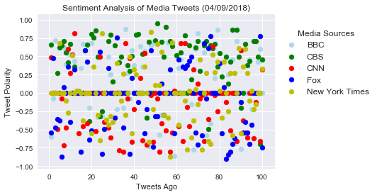

## Sentiment Analysis and Data Output

#### 1. CBS tends to have a more positive tweets than the other media sources analyzed
#### 2. According to VADER analysis, more negatively rated tweets tend to occur on Friday afternoons (as of 09 April 2018 data)
#### 3. The overall average compound scores of the media sources from most positive to most negative are in the following order: CBS, BBC, NY Times, Fox, and CNN (as of 09 April 2018 data)

```python
# Import Dependencies
import json
import tweepy
import numpy as np
import matplotlib.pyplot as plt
import pandas as pd
import seaborn as sns
import time
```


```python
# Import and Initialize Sentiment Analyzer
from vaderSentiment.vaderSentiment import SentimentIntensityAnalyzer
analyzer = SentimentIntensityAnalyzer()
```


```python
# Import Twitter API Keys
from config import consumer_key, consumer_secret, access_token, access_token_secret
```


```python
# Setup Tweepy API Authentication
auth = tweepy.OAuthHandler(consumer_key, consumer_secret)
auth.set_access_token(access_token, access_token_secret)
api = tweepy.API(auth, parser=tweepy.parsers.JSONParser())
```


```python
# News Organization accounts
news_organizations = "@CNN", "@BBC", "@CBS", "@FoxNews", "@nytimes"

# Variables for holding sentiments and setting counter
sentiments = []
counter = 1

# Loop through tweets
for organization in news_organizations:
    tweet_number = 1

    # Get all tweets from home feed
    public_tweets = api.user_timeline(organization, count=100)

    # Loop through all tweets
    for tweet in public_tweets:
        print("Tweet %s: %s" % (counter, tweet["text"]))

        # Run Vader Analysis on each tweet
        compound = analyzer.polarity_scores(tweet["text"])["compound"]
        pos = analyzer.polarity_scores(tweet["text"])["pos"]
        neu = analyzer.polarity_scores(tweet["text"])["neu"]
        neg = analyzer.polarity_scores(tweet["text"])["neg"]
        tweets_ago = counter

        #Append into sentiment  
        sentiments.append({"Tweets Ago": tweet_number,
                          "Media Sources": organization,
                          "Text":tweet["text"],
                          "Date": tweet["created_at"],
                          "Compound": compound,
                          "Positive": pos,
                          "Neutral": neu,
                          "Negative": neg,
                           })
        tweet_number +=1
        counter +=1
```

    Tweet 1: Among the records seized from Donald Trump’s personal attorney, Michael Cohen, were communications between Cohen an… https://t.co/n575npOrMk
    Tweet 2: President Trump slams Attorney General Jeff Sessions over his decision to recuse himself in the Russia investigatio… https://t.co/vyreOV6d5o
    Tweet 3: JUST IN: President Trump says the FBI raid of his personal attorney, Michael Cohen, is a “real disgrace, it’s an at… https://t.co/Vuwil2PkaB
    Tweet 4: RT @AC360: JUST IN: Among the records seized from Donald Trump’s personal attorney were communications between Michael Cohen and Trump, acc…
    Tweet 5: "Black Panther" passes "Titanic" at the box office on the all-time list of highest grossing films… https://t.co/igIIinGUCB
    Tweet 6: There was no working smoke alarm in the Trump Tower apartment where a deadly fire started, a source says… https://t.co/KRMhPxaYvK
    Tweet 7: The US will respond to the Assad regime's alleged chemical attack against Syrian civilians, US Ambassador Nikki Hal… https://t.co/Z0mO1CB2Nb
    Tweet 8: Rep. Ruben Gallego: I'd like to remind the viewers, it's only Monday. So, God knows what's going to happen the rest… https://t.co/lUxMXkIUbe
    Tweet 9: RT @CNNSitRoom: A source close to the White House says Mueller’s decision to raid the offices of Michael Cohen could well push the Presiden…
    Tweet 10: The US Department of Justice announced that seven people associated with Backpage, a classified ads website, have b… https://t.co/9ljV0ps3PH
    Tweet 11: Encourage moves toward religious freedom by Islamic leaders | By Johnnie Moore via @CNNOpinion… https://t.co/fkIMeCysCL
    Tweet 12: The FBI just raided Michael Cohen's office. Here's what he still hasn't told us about the Stormy Daniels payment. |… https://t.co/9QXtOteWnz
    Tweet 13: More than 4,000 black men, women, and children died at the hands of white mobs between 1877 and 1950. This memorial… https://t.co/mSkXgTKkzo
    Tweet 14: The nonpartisan Congressional Budget Office has released its 10-year budget and economic outlook, and it projects t… https://t.co/qwSccoJfeO
    Tweet 15: The biggest Black Lives Matter page on Facebook is fake https://t.co/exaqtOt1mR https://t.co/3Cvgp6Hkl6
    Tweet 16: First Fortune 500 Latina CEO Geisha Williams tells @PoppyHarlowCNN why she believes immigrants are a "secret weapon… https://t.co/WFwj5wxrzs
    Tweet 17: The monster responsible for these attacks has no conscience. “The Russian regime, whose hands are all covered in th… https://t.co/DUu8ANs470
    Tweet 18: JUST IN: President Trump has been watching TV reports of the FBI raiding the office of Michael Cohen, his longtime… https://t.co/ypHS41Y9yG
    Tweet 19: "This is war." @BillKristol says he thinks the FBI raiding Trump attorney Michael Cohen's office "shows that we are… https://t.co/7NGqVCX68E
    Tweet 20: RT @CNNMoney: Dow finishes up 46 points after most of a 440-point rally melts away. Nasdaq closes up 0.5%, S&amp;P 500 up 0.3%. https://t.co/qR…
    Tweet 21: “Only a monster targets civilians and then ensures that there are no ambulances to transfer the wounded, no hospita… https://t.co/En2Bf3vwAH
    Tweet 22: BREAKING: The FBI raided the office of the President's longtime attorney and confidant, Michael Cohen, the New York… https://t.co/A0Xx3te0hz
    Tweet 23: Porn star Stormy Daniels said in a new court filing that she would not have signed a hush agreement in 2016 had she… https://t.co/9WYYthR8h1
    Tweet 24: Donald Trump just made the Masters all about him | Analysis by @CillizzaCNN https://t.co/hGcUTaTwTj https://t.co/HGVQNlCbhd
    Tweet 25: White House press secretary Sarah Sanders on Trump's debunked voter fraud claim: "The President still strongly feel… https://t.co/jgybW3E0FJ
    Tweet 26: Apple co-founder Steve Wozniak says he's "disgusted" by how Facebook handles personal information, and that he deac… https://t.co/nQCRJjlbPF
    Tweet 27: Facebook has suspended another data analytics company following allegations that it misled its users over how their… https://t.co/ngLR7ZO2hR
    Tweet 28: RT @CNNPolitics: Sanders on whether Trump’s attitude toward Russian President Vladimir Putin has changed after the suspected attack in Syri…
    Tweet 29: The Democratic case against impeaching President Trump | Analysis by @CillizzaCNN https://t.co/iJhkbkgwiN https://t.co/Gne816Sdqz
    Tweet 30: RT @CNNPolitics: Sanders: “Signaling we want to remove our troops in no way degrades our ability to hold parties responsible” https://t.co/…
    Tweet 31: As images of Syrian children gasping and convulsing spread around the world, President Trump and other internationa… https://t.co/RdfRTlBJQ0
    Tweet 32: White House press secretary Sarah Sanders on the suspected chemical weapons attack in Syria: “As President Trump cl… https://t.co/OobP8EM9Tf
    Tweet 33: White House press secretary Sarah Sanders talks to reporters after President Trump said he would make a decision so… https://t.co/f0GqzDioAR
    Tweet 34: Sean Hannity, who mocked Michelle Obama, says it's wrong to mock Melania Trump | via @CNNopinion… https://t.co/qWhCeSNLgG
    Tweet 35: Prince Harry and Meghan Markle are asking people who wish to send them a wedding gift to consider donating to one o… https://t.co/NHkoaY67G8
    Tweet 36: "Black Panther" passes "Titanic" at the box office on the all-time list of highest grossing films… https://t.co/K3YcmgZUNa
    Tweet 37: A bodyguard for boxing champ Floyd Mayweather is recovering at an Atlanta hospital after being shot in the leg outs… https://t.co/ojVt62HPF5
    Tweet 38: Gassed where they had hidden, Syrian families were killed in minutes.

    11 people from one family and eight from ano… https://t.co/01Z01avB0K
    Tweet 39: David Hogg, one of Marjory Stoneman Douglas High School's most visible student activists, will postpone his first y… https://t.co/oketcR6Acj
    Tweet 40: Illinois Democratic Sen. Tammy Duckworth gave birth to a baby girl Monday, her office announced, the first US senat… https://t.co/G8vl4Vc2CV
    Tweet 41: RT @CNNPolitics: Sen. Bill Nelson: If we don’t act on Facebook, “none of us are going to have any privacy anymore” https://t.co/j2vKcfuFuo
    Tweet 42: The federal government's top voice on ethics sent a letter to the EPA outlining areas of concern regarding agency c… https://t.co/GQcZs2YBFN
    Tweet 43: Voters in Anchorage, Alaska, narrowly reject a proposal to restrict bathroom access for transgender people, the fir… https://t.co/1XDALjEFwm
    Tweet 44: Why Rick Scott's Senate candidacy is very, very good news for Republicans | Analysis by @CillizzaCNN… https://t.co/pGpb2HfJQz
    Tweet 45: Just before Bill Cosby walked into court Monday morning, a topless protester with "Cosby rapist" and women's names… https://t.co/dEBpuMfsbD
    Tweet 46: The stock market can't figure out President Trump's trade policy https://t.co/HAB2bsxco0 https://t.co/UoCsLTvhKE
    Tweet 47: Pope Francis says helping the poor and migrants is as important as opposing abortion https://t.co/B9rmyQdHgS https://t.co/XtVV4kelqz
    Tweet 48: At least 23 schoolchildren were among those killed Monday in northern India after their bus skidded off the road an… https://t.co/67yfiJaJxX
    Tweet 49: Some Facebook users can now see whether their data may have been obtained by political data firm Cambridge Analytic… https://t.co/HFVSiXVeK4
    Tweet 50: Mark Zuckerberg has a clear message for Congress in the wake of the Cambridge Analytica scandal: It's my fault:… https://t.co/sl6PxaHXyO
    Tweet 51: President Trump strongly condemns the "atrocious" chemical weapons attack in Syria and says a decision on US action… https://t.co/wBVvORqpm0
    Tweet 52: Does Putin bear responsibility for the suspected chemical attack in Syria?

    President Trump: “He may, yeah, he may.… https://t.co/tmDaXti97p
    Tweet 53: President Trump: “We’ll be making some major decisions over the next 24 to 48 hours” on a US response to the suspec… https://t.co/iSTwBp9FOX
    Tweet 54: President Trump condemns the “heinous attack” on Syrian civilians: “This is about humanity... If it’s Russia, if it… https://t.co/vQxuUYgOo0
    Tweet 55: Facebook CEO Mark Zuckerberg is on Capitol Hill to meet with lawmakers, including members of committees holding hea… https://t.co/vTmwxfTEHS
    Tweet 56: Sean Hannity, who mocked Michelle Obama, says it's wrong to mock Melania Trump | via @CNNopinion… https://t.co/AgR2qL6zuv
    Tweet 57: Oklahoma teachers continue their walkout for a sixth day today, maintaining their pressure on state legislators for… https://t.co/Jppkmfi74G
    Tweet 58: Rick Scott is the toughest challenger Bill Nelson has faced for Florida Senate, but Nelson's still a slight favorit… https://t.co/EHq9izkgN9
    Tweet 59: What cities and states are doing about guns since the Parkland shooting https://t.co/vngGcWVQF7 https://t.co/9chaUhwhAl
    Tweet 60: The FDA worried this drug was risky. Now doctors are concerned about the report of more than 700 deaths in the less… https://t.co/esK5Q2wVDM
    Tweet 61: People from both Canada and the United States are sharing photos of hockey sticks left on porches as a tribute to p… https://t.co/ubUTEoRBxU
    Tweet 62: A disaster was narrowly averted in eastern India on Saturday after a runaway train carrying up to 1,000 passengers… https://t.co/3DeQiqTNRR
    Tweet 63: Prince Harry and Meghan Markle are asking people who wish to send them a wedding gift to consider donating to one o… https://t.co/BOh2wHicgI
    Tweet 64: When it comes to Syria, President Trump can tweet and launch strikes if he wants, but not much else | Analysis by… https://t.co/q5wp5kGq43
    Tweet 65: RT @cnni: Two of the most wanted fighters from the British ISIS cell called "the Beatles" spoke with @npwcnn from inside the detention faci…
    Tweet 66: As images of Syrian children gasping and convulsing spread around the world, President Trump and other internationa… https://t.co/QFqM3UzVxs
    Tweet 67: Life coach Tony Robbins apologized for his comments about the #MeToo movement after suggesting during a March event… https://t.co/U0Ln3fjW8v
    Tweet 68: From political refugee to CEO: How Geisha Williams made history by becoming the first Latina CEO of a Fortune 500 C… https://t.co/v9AAlj9mmM
    Tweet 69: Defense Secretary James Mattis on the possibility of launching airstrikes against Syrian President Bashar al-Assad'… https://t.co/4Oi2LTEfJ4
    Tweet 70: "Black Panther" passes "Titanic" at the box office on the all-time list of highest grossing films… https://t.co/Lf9lIVteVA
    Tweet 71: Attorney General Jeff Sessions just made the opioid war harder to win | via @CNNopinion https://t.co/eO2ZYGLkm8 https://t.co/5ZmHgOzoz7
    Tweet 72: A disaster was narrowly averted in eastern India after a runaway train carrying up to 1,000 passengers rolled with… https://t.co/lGO0pA0YRX
    Tweet 73: Syria and it most powerful ally, Russia, blamed Israel for striking an airbase in the war-torn country on Monday, f… https://t.co/dU3bFRhJlV
    Tweet 74: Stormy Daniels' legal team plans to release a composite sketch of the man the porn star says threatened her in 2011… https://t.co/Rbmaf5sW4J
    Tweet 75: Florida Republican Gov. Rick Scott says he's running for the US Senate, setting up a serious challenge to the state… https://t.co/9oHrPWsZw6
    Tweet 76: Beyond Tokyo: 8 of Japan's best foodie destinations https://t.co/0vjI9pVzDK via @CNNTravel https://t.co/MPo2WPjbfX
    Tweet 77: Pope Francis says helping the poor and migrants is as important as opposing abortion https://t.co/XHbOXLchua https://t.co/XXBefmOdcn
    Tweet 78: Russia's Defense Ministry has claimed that Israel was behind a series of strikes on an airbase in central Syria on… https://t.co/IrPIXbxHUd
    Tweet 79: Donald Trump always strives to command center stage, but the US President is now embroiled in so many escalating gl… https://t.co/2yZT9mnSSF
    Tweet 80: Deutsche Bank, Germany's biggest lender, is getting rid of its CEO after years of heavy losses.… https://t.co/O1UvpLNxyz
    Tweet 81: 4 questions Congress must ask Facebook CEO Mark Zuckerberg https://t.co/5PaplSDYRt https://t.co/TPsfQPpUKu
    Tweet 82: Two of the most wanted fighters from the British ISIS cell known as "the Beatles" have called some of the group's a… https://t.co/ErTHLwtmHe
    Tweet 83: Facebook CEO Mark Zuckerberg is on Capitol Hill today to meet with lawmakers, including members of committees holdi… https://t.co/TEjSDM8O0O
    Tweet 84: New York Times top editor on journalism's "biggest crisis" https://t.co/YZqAM2JZ2X https://t.co/aGlBwRjZrc
    Tweet 85: What cities and states are doing about guns since the Parkland shooting https://t.co/x2gNmQqcvg https://t.co/q70mtKVUqn
    Tweet 86: Designing for hedonists: The evolution of nightclub interiors https://t.co/PJKGBCwL2b via @CNNStyle https://t.co/osJPpj5Jlo
    Tweet 87: A disaster was narrowly averted in eastern India on Saturday after a runaway train carrying up to 1,000 passengers… https://t.co/VGZeMMBqZ9
    Tweet 88: How President Trump might counter "Animal Assad" https://t.co/1UCL0ugNRt | via @CNNOpinion https://t.co/6Vxl00eqbc
    Tweet 89: 16-year-old breaks Commonwealth Games record to win shooting gold for India https://t.co/ckEnqdDG2p https://t.co/Y7CYQy1zrp
    Tweet 90: Here's everything you need to know about the US-China trade battle https://t.co/qfAXCtoeph https://t.co/qc6MwmahAG
    Tweet 91: Oklahoma teachers will continue their walkout for a sixth day today, maintaining their pressure on state legislator… https://t.co/FdYFsxlo0U
    Tweet 92: Lightning strike kills 1, injures 4 in Florida https://t.co/iDZeD9keEh https://t.co/MnHKWwyfzB
    Tweet 93: Atlanta is the world's busiest airport for another year. Here's the rest of the list: https://t.co/qy5qAnTwjG
    Tweet 94: As images of Syrian children gasping and convulsing spread around the world, President Trump and other internationa… https://t.co/4UF8wtRLft
    Tweet 95: RT @NewDay: "They're really very ordinary," says @npwcnn of British ISIS terrorists called "the Beatles."

    "Unextraordinary people to some…
    Tweet 96: Two of the most wanted fighters from the British ISIS cell called "the Beatles" have called some of the group's act… https://t.co/TJ5ez1pFVh
    Tweet 97: US military resumes air operations in Djibouti https://t.co/tb7GCGzpIl https://t.co/dMKZRtdHaw
    Tweet 98: Ferrari mechanic suffers a broken leg after being hit by a car during a pit stop at the Bahrain Grand Prix https://t.co/Hz9pxAiJFO
    Tweet 99: Life coach Tony Robbins apologized for his comments about the #MeToo movement after suggesting during a March event… https://t.co/iWTVDtKsqB
    Tweet 100: Advocacy groups claim YouTube illegally collects data from kids https://t.co/cekqlCi0z1 https://t.co/zjlS4plfp6
    Tweet 101: In this five-part immersive living history series, the training programme of one of World War Two's most covert org… https://t.co/WMq4ME93CR
    Tweet 102: When doctors found a large tumour on little Poppy’s brain, her parents faced one of the toughest decisions of their… https://t.co/bJp258jCaL
    Tweet 103: Keep full and satisfied with these protein-filled, vegetarian dinners.
    Make double portions and save for lunch tom… https://t.co/yh3RGeC5i3
    Tweet 104: RT @BBCScotland: The history behind #NationalUnicornDay 🦄

    *may not be factually accurate* https://t.co/p44XmIXnoM
    Tweet 105: RT @BBCTwo: Can you guess the city? #TheCityAndTheCity’s @davemorrissey64 and @MandiDhillon tried our game out for size… 🌆🏙🙃 https://t.co/U…
    Tweet 106: The latest episode of @TheSimpsons has addressed controversy surrounding Indian character Apu for the first time.
    👉… https://t.co/guqD0Pf53R
    Tweet 107: 🏃‍♀️❤️ What a brilliant idea! https://t.co/QUVCwBptOU
    Tweet 108: RT @BBCTheOneShow: Tonight on The One Show - @kylieminogue! 💗💗💗💗💗 RT: if you're excited. #TheOneShow #KylieMinogue #Kylie https://t.co/Yten…
    Tweet 109: RT @BBCSport: What a way to save match point!

    Table tennis is pure carnage.

    #GC2018 #bbcgoldcoast https://t.co/1shVrSJuRn
    Tweet 110: 🐶❤️😽
    Henry and Baloo: Dog and cat travel companions gain cult following.
    👉 https://t.co/rTpxqa69Oq https://t.co/iRkQXMwnyv
    Tweet 111: A new campaign is encouraging people to do CPR to the tune of @The_Proclaimers' hit 'I'm Gonna Be (500 miles)'.
    👉… https://t.co/MULW1tgRPL
    Tweet 112: How NOT to impress Madonna...
    #TheGrahamNortonShow #TGNS https://t.co/NnYS15sU9p
    Tweet 113: RT @bbccomedy: Philomena Cunk steps on board the first ship to circumcise the globe. #CunkOnBritain @missdianemorgan https://t.co/f1oHsolPHe
    Tweet 114: 🌭🐶 Over 1,500 people turned up to this mass sausage dog walk in Manchester yesterday. https://t.co/6fscMy6eZ7
    Tweet 115: RT @bbcsoutheast: You don't have to be married to take part in "wife-carrying". Fancy giving it a go? #Dorking #wifecarrying #wifecarryingu…
    Tweet 116: RT @BBCnireland: As the days get longer, here are some #TightShorts tips on creating that naturally flawless, 'don't get seen, blend into t…
    Tweet 117: Flipping the script on dyslexia. https://t.co/rW1FLygX9V
    Tweet 118: RT @bbcthesocial: This is how homophobia feels in 2018.

    #TimeForLove https://t.co/dHfsvt94Nz
    Tweet 119: RT @BBCFOUR: How do you cope with stage fright when you're working at music's top level? Listen to the new #BBCYoungMusician podcast with @…
    Tweet 120: Love hurts, but this is a step too far...

    💍 People are getting finger piercings instead of engagement rings.
    👉… https://t.co/eargluPvnC
    Tweet 121: 😴🐻 When the weather is so cold that you can't bear to get up.
    #MondayMorning https://t.co/JhfqRhL5fQ
    Tweet 122: RT @BBCTwo: Every Saga must come to an end... #TheBridge https://t.co/YNyeMUM8A2
    Tweet 123: RT @BBCRadio4: "If a £100 coat is half price, and you buy it, you haven't saved £50 you've spent £50."
    https://t.co/yKrYlW9jf6
    Tweet 124: 😲🚂 Hop onboard the train that (somehow) squeezes through a crowded market near Bangkok, eight times a day! https://t.co/htvLHtJdPH
    Tweet 125: The story of why the Roman Baths developed, how they were lost for many centuries and how they were rediscovered.… https://t.co/zEzPchOgPO
    Tweet 126: 🏥 How can #3DPrinting be of use in surgery? https://t.co/3LQkXMMHwo
    Tweet 127: 😺💦 This is Maya the jaguar's very first swim!  
    #BigCatsAboutTheHouse https://t.co/IacZP3ltf3
    Tweet 128: 😂 Need a hand getting the kids to bed? https://t.co/JAUkyoVSA8
    Tweet 129: 'Silencing masks' and 'wife auctions': What life used to be like for women.
    👉 https://t.co/7Z1bcXKgOx https://t.co/gzm7Hf3loH
    Tweet 130: 🦖😂 Philomena Cunk examines the barbaric conditions in which we keep today's dinosaurs.
    #CunkOnBritain  https://t.co/nBav5dqh7a
    Tweet 131: RT @bbcgetinspired: Meet Sue...

    She is planning to run the 2018 @LondonMarathon to prove someone with vascular dementia can do it. 🙌

    ➡ ht…
    Tweet 132: 🎨 Victoria Lomasko is a Russian graphic artist who's travelled up and down her country painting 'forgotten women'. https://t.co/XtlpBlAYb0
    Tweet 133: 🎶 The search for the next Young Musician has begun, and the first @BBCYoungMus semi-finalist of 2018 has been confi… https://t.co/klUA4GWtb0
    Tweet 134: 'If boys are getting diagnosed with autism, girls need exactly the same.' https://t.co/f7Aft0LWwB
    Tweet 135: 💃🕺 Meet the kids cutting some serious shapes on the streets of Lagos. https://t.co/3ySZPqua01
    Tweet 136: RT @BBCSport: What a nice surprise 😍💍

    Two of @TeamEngland 's basketball players got engaged on court at the Commonwealths.

    Congrats @Jam…
    Tweet 137: 😂 'Surprise me'. https://t.co/Jo7illTafh
    Tweet 138: When doctors found a large tumour on little Poppy’s brain, her parents faced one of the toughest decisions of their… https://t.co/MGM0dpxlFH
    Tweet 139: RT @BBCSport: Beauty queen ✅
    Commonwealth Games weightlifting silver medallist ✅

    Introducing Sarah Davies...

    #GC2018 #bbcgoldcoast https:…
    Tweet 140: From Ordeal by Innocence to the return of The Handmaid’s Tale, here are @BBC_Culture's pick of programmes to watch… https://t.co/Q6S34uv5LX
    Tweet 141: 🦍💬 Not only can Koko the gorilla use sign language, she also appears to have learnt to lie...

    https://t.co/xXZwlLDLJh
    Tweet 142: RT @BBCOne: .@johnkrasinski's got MOVES. #TheGrahamNortonShow #TGNS https://t.co/2HUMM0ixEW
    Tweet 143: Football, volleyball AND martial arts? ️⚽️🥋🤔

    Sepak Takraw is the best sport you've never heard of...

    https://t.co/ngTwJHEmrI
    Tweet 144: 🐳 Meet the gargantuan air freighter that looks like a whale. https://t.co/7DPUt8okKU
    Tweet 145: ❤️🎶 @NiallOfficial's Live Lounge cover of @JuliaMichaels' Issues is just perfect.  https://t.co/XpsnR29hPU
    Tweet 146: RT @CBeebiesHQ: Goodnight @ChrisEvans,🌙

    Chris reads Goodnight Goodnight Construction site tonight. 🏗️

    #BedtimeStory is at 6:50pm 😴💤 htt…
    Tweet 147: 🦁😢 Lions are often poisoned to prevent them attacking livestock. https://t.co/254nhtlMW5
    Tweet 148: 😲 Some VERY impressive maths here.
    #UniversityChallenge https://t.co/crvQQ5V3Vn
    Tweet 149: Doctors are finding one way that sugar can benefit your health - it may help heal wounds resistant to antibiotics.… https://t.co/zI9pN0zSVo
    Tweet 150: RT @BBCRadio2: "The clunk of putting the cassette in, snapping it shut... oh wait I'm going to rewind to get to the start of the song. It's…
    Tweet 151: 🌎📸 Our pick of the most striking news photographs taken around the world recently.
    👉 https://t.co/zPpuZq9hOC https://t.co/fYUTrG44Ra
    Tweet 152: How did this new mum survive in the chaos that followed Hurricane Maria? https://t.co/Nx7uFz1k56
    Tweet 153: For Dr Joel Salinas, music creates colours, numbers have personalities and another person's pain feels almost like… https://t.co/lrGhiKBaGZ
    Tweet 154: RT @bbcthree: 94-year-old Judo Jack says: "Get off your butt and do something." https://t.co/M9CzCtwSqe
    Tweet 155: RT @BBCR1: It's been one whole year of Sign Of The Times and we need to know whether @Harry_Styles finally let Chris Martin be head of his…
    Tweet 156: What an inspiration! 💪

    ❤️ Fraser shed the pounds to pursue his wrestling dream, in memory of his mother. https://t.co/LWmuGo6dTN
    Tweet 157: RT @BBCSport: It's a historic victory for Uganda! 🙌

    Earlier today they recorded their first ever victory at the Commonwealth games with a…
    Tweet 158: 🍓🍒 Did you know that cherries and strawberries represented the souls of men? Or that a dragonfly could be the devil… https://t.co/s9rFhv5wlu
    Tweet 159: Losing your hair whilst going through cancer treatment can be distressing.

    This shop decided to try and do someth… https://t.co/mcOgFrRtdq
    Tweet 160: 🗑🤖 This trash collecting robot can be controlled by anyone via the internet. https://t.co/N2gbeP2nIo
    Tweet 161: RT @bbcgetinspired: 'Women don't just stay at home and look after the kids, we don't just do dance or gymnastics, we play tennis, football…
    Tweet 162: 😍🐿 These baby red squirrels are too cute to handle. https://t.co/d2r7c8EyUh
    Tweet 163: RT @bbcmusic: Jade, this was INCREDIBLE 😍
    #SoundsLikeFridayNight https://t.co/rSGnYVTFYu
    Tweet 164: 🤔 Modern life is a mystery. https://t.co/a4817Iugzz
    Tweet 165: Tune in to #SLFN tonight for performances from @snowpatrol, @Meghan_Trainor, @yearsandyears and @halsey. 🎶🎤🎉

    Sound… https://t.co/EFjiBk5upm
    Tweet 166: RT @bbcpointswest: 🤩 Prince Harry and Meghan Markle arrive in Bath for the Invictus Games trials 🤩 https://t.co/ywlHvaHt2z
    Tweet 167: 😂 If you're going to get dumped on TV, it might as well be via @KylieMinogue.

    #TheGNShow | 10.35pm | @BBCOne https://t.co/CgfsjKjeob
    Tweet 168: RT @BBCNewsround: Ever wondered why we cry when we chop onions? Now you'll have no excuse to avoid cooking dinner, sorry! 😂https://t.co/SyX…
    Tweet 169: RT @BBCOne: MY OLD FRIEND.

    #OrdealByInnocence #Sunshine https://t.co/vQBvcgLrCe
    Tweet 170: 🎻 Two years ago @ShekuKM won @BBCYoungMus.
    Now he wants to inspire other young people to pick up an instrument too… https://t.co/fG0F3x2eDN
    Tweet 171: RT @bbcgetinspired: She's only 11 years old, but @sport_wales' Anna Hursey is smashing it at #GC2018! 🙌

    ➡ https://t.co/9sFYGzsgnQ #GetIns…
    Tweet 172: RT @bbcmusic: Counting down the seconds TBH 💅@LittleMix https://t.co/6UTrz9gqQr
    Tweet 173: 🍞🍻 Hate food waste but love beer? https://t.co/IL9jmlaMjs
    Tweet 174: RT @BBCRadio3: "Stop being so selfish – this isn’t about you." Harsh words - or tough love?
    Zeynep, Jess and Sam discuss one teacher’s cont…
    Tweet 175: 🐘 🦏🦒🔭
    Saving animals using space technology. https://t.co/gAwJcD2I2A
    Tweet 176: 🍿🎟 From a near-silent horror film to an Australian Western, here are 8 movies worth watching in April.
    👉… https://t.co/b15kbsQ7MD
    Tweet 177: RT @BBCOne: For all the drama queens. 👑 https://t.co/RfdMDieaCZ
    Tweet 178: 💃🕺 Meet the dancers from Lagos who've been tipped for the top by @Rihanna and @NaomiCampbell. https://t.co/3ySZPqcyBr
    Tweet 179: RT @BBCSport: Gareth Evans absolutely loved it! 💪

    This is how it felt to win Wales' first gold! 🥇🏴󠁧󠁢󠁷󠁬󠁳󠁿

    #GC2018 #bbcgoldcoast https://t…
    Tweet 180: 🦁🦏🐆
    Royal pets are now more synonymous with corgis than wild animals, but historically monarchs would own an array… https://t.co/5VVyiWHPv1
    Tweet 181: 😻 Say hello to Willow the cheetah!
    #BigCatsAboutTheHouse https://t.co/e9xNVjR0gi
    Tweet 182: RT @BBCSport: It all happened in the weightlifting... #GC2018 https://t.co/s8qnPsuyaz
    Tweet 183: RT @BBCBreakfast: All you need to know about the 'sugar tax' and how your favourite soft drink may change. https://t.co/mjFwTN1UHs
    Tweet 184: RT @bbcpress: 📸 #FirstLook at Eleanor Tomlinson and Rafe Spall in @BBCOne adaptation of H.G. Wells' #WarOfTheWorlds as filming begins: http…
    Tweet 185: 😲🎨🇿🇦 Hotel or modern art museum?
    #AmazingHotels https://t.co/Xbmjzviivh
    Tweet 186: It might not always feel like it, but psychologist @sapinker is convinced that the world is on the up. https://t.co/a8PrDXjDcL
    Tweet 187: 'There’s the England before Stephen, and there’s the England after Stephen.'

    Stephen: The Murder That Changed a N… https://t.co/BLynBXYH7I
    Tweet 188: 🐆 Could building walkways in nature help save these big cats?
    #BigCatsAboutTheHouse https://t.co/NdkxCDBpee
    Tweet 189: 😋😋 Pocket-friendly recipes for two.
    👉 https://t.co/CzuDNQNw3B https://t.co/xbrrmlIgNF
    Tweet 190: 👀 From illegal ivory to taxidermy, take a peek inside the banned wildlife room at Heathrow Airport. https://t.co/8yIok0eobX
    Tweet 191: RT @bbccomedy: Smithy is an irl ray of #sunshine. https://t.co/NgA4t4jZob
    Tweet 192: RT @BBCTheOneShow: ..@DIYSOS  are building a gym and community area for the Grenfell community, but @MrNickKnowles needs something specific…
    Tweet 193: RT @bbcmusic: STOP EVERYTHING: @GaryBarlow is coming to Sounds Like Friday Night 🙌💪
    Don't miss it: 7.30pm, Friday, @BBCOne 💫#SLFN https://…
    Tweet 194: RT @BBCOne: You took your sweet time.

    #Poldark #sunshine https://t.co/Ep33Zt5YZi
    Tweet 195: It's time society stopped judging black women by their hair, British-Somali artist @blackpowerpufff says.… https://t.co/lRmAfxmefR
    Tweet 196: 📚 A biography about conjoined twins from Siam who became US slave-owners + 9 other books to bury your nose in this… https://t.co/1UfP6LTH0i
    Tweet 197: RT @BBCSport: Scotland's Hannah Miley takes the silver in the women's 400m individual medley! 🥈 https://t.co/GrailyYrno #bbcgoldcoast https…
    Tweet 198: 😍🐿 A trio of baby red squirrels have been rescued in Perthshire.  https://t.co/d2r7c8EyUh
    Tweet 199: RT @BBCBreakfast: Some GOOD plastic news!
    Marine conservationists say the 5p carrier bag charge has reduced the amount of single use plasti…
    Tweet 200: RT @BBCRadio2: What happens when you put one harp, three fiddles, and the cream of the folk world in one room?

    We brought together @elizac…
    Tweet 201: Are you ready for a good time? Tomorrow, Elton John: I’m Still Standing - A GRAMMY® Salute airs at 9/8c on CBS and… https://t.co/Z3Mnp1cJPa
    Tweet 202: @edsheeran, @KeshaRose, @HaileeSteinfeld, @ActuallyNPH, and many more describe the impact that the music of Elton J… https://t.co/wBwzWcWGAa
    Tweet 203: Lights will come on for @Jason_Aldean when he takes the stage to perform at the 53rd #ACMawards on Sunday, April 15… https://t.co/qPAbrFp4kQ
    Tweet 204: Which state does @reba call home and which song was her first No. 1 single? Test your knowledge of the beloved coun… https://t.co/Sp8icKpFNu
    Tweet 205: This just in! Thirteen-time ACM Award® winner @carrieunderwood will be performing her soon-to-be-released single li… https://t.co/GEyjt4lFbb
    Tweet 206: It's time to celebrate! @MomCBS will be back for Season 6! https://t.co/ianxp6JWHq
    Tweet 207: @OldDominion's Matthew Ramsey is here with a friendly reminder - Country Music’s Party Of The Year® is just seven d… https://t.co/SFnXxQLoPN
    Tweet 208: It all comes down to this! Stream Round 4 of #TheMasters Tournament on CBS live with a free trial of CBS All Access… https://t.co/mNFSAUkLvZ
    Tweet 209: @reba is ready for her hosting duties! In just one week, watch her take the stage at the 53rd #ACMawards. Tune in A… https://t.co/TmjezmqPme
    Tweet 210: Watch some of the biggest names in golf compete in one of the greatest tournaments of the year! Stream #TheMasters… https://t.co/e8kbkSLx5k
    Tweet 211: Tonight's the night! Here's a behind-the-scenes look at season 2 of @RansomCBS before the big premiere. Tune in at… https://t.co/WtRHvufO7H
    Tweet 212: What song will @DierksBentley belt out when he takes the stage to perform at the 53rd #ACMawards? Get ready to sing… https://t.co/oEtKJnKQVn
    Tweet 213: @johnlegend, @mirandalambert, @KeshaRose, and more perform @eltonofficial's hit songs! Watch Elton John: I'm Still… https://t.co/VF3hf8OCT7
    Tweet 214: Ask 53rd ACM Awards® host @reba a question and she just may answer it on April 11 at 5:30p ET/2:30p PT when she tak… https://t.co/DAa5gQS8oX
    Tweet 215: What’s @eltonofficial's birth name and which of his songs holds the record for biggest selling single of all time?… https://t.co/N5qkMYCE7e
    Tweet 216: Do you have a question for country music legend and host of the 53rd ACM Awards® @reba? Write it below for a chance… https://t.co/yVVDVFpxDM
    Tweet 217: How well do you know The Academy of Country Music Awards™? Test your knowledge of Country Music’s Party of the Year… https://t.co/lfWAcvAbZa
    Tweet 218: RT @CodeBlackCBS: The intensity and emotions of your favorite show are returning to @CBS in 3 weeks.

    Get excited. https://t.co/aGUNIPwRjh
    Tweet 219: Don't miss @littlebigtown's amazing performance of @eltonofficial's "Rocket Man" under the big spotlight at Elton J… https://t.co/bqse7nhkV3
    Tweet 220: Today's biggest stars are celebrating @EltonJohn's most beloved and legendary catalogue of hits with two albums dro… https://t.co/cilUdkKtjQ
    Tweet 221: RT @LifeInPiecesCBS: We "literally can't even" with how hilarious these #LifeInPieces outtakes are! 😂

    Introducing Laughing To Pieces! Foll…
    Tweet 222: RT @YoungSheldon: Don't miss guest star @Followtheblonde in tomorrow's all-new #YoungSheldon! Trust us, you're going to love every minute.…
    Tweet 223: RT @MomCBS: Tomorrow's episode of #Mom is going to be a doggone good one! https://t.co/e1WI3uOxVg
    Tweet 224: RT @survivorcbs: There's a lot at stake when competing for actual steak. Get a glimpse at an all-new #Survivor: Ghost Island at 8/7c on CBS…
    Tweet 225: RT @TVLine: #LifeInPieces Sneak Peek: Sophia and Her Stuffed Toys Stage a Musical Protest https://t.co/r16SLZlZPc
    Tweet 226: Whose catchy tune will take Song Of The Year at the 53rd #ACMawards? Give it up for the four nominees -… https://t.co/R9MtUNZtsw
    Tweet 227: Here's everything you need to know before tuning into Elton John: I'm Still Standing - A GRAMMY® Salute on Tuesday,… https://t.co/C8fiKl4j98
    Tweet 228: In just one week, @eltonofficial and today's hottest stars in music will join together to celebrate Elton's countle… https://t.co/ACQGHNWz8u
    Tweet 229: Tonight we #LightItUpBlue for greater understanding and acceptance. CBS supports #WorldAutismAwarenessDay by lighti… https://t.co/hBAXcDvP4r
    Tweet 230: No one does it quite like @eltonofficial. The artist himself will belt out some of his chart-topping hits on Elton… https://t.co/ckY4bUvTXI
    Tweet 231: The Las Vegas strip is about to light up brighter than ever before when Country Music’s Party Of The Year® takes ov… https://t.co/j1A2ZVHAoO
    Tweet 232: “If you don’t do something about it, then who are you? … It can happen to anyone.” - @aplusk

    Tonight at 10/9c, a… https://t.co/EQabNc1UZI
    Tweet 233: Give it up for @KelseaBallerini! This star is one of the Female Vocalist Of The Year nominees and she's ready to ta… https://t.co/wLyHwkEGs2
    Tweet 234: Take and post a photo of the woman in your life who inspires you! The photo should only have one person against a n… https://t.co/BHdxXlWfKP
    Tweet 235: Expect epic performances by @kanebrown , @kelly_clarkson, @OfficialJackson, and more at this year's 53rd #ACMawards… https://t.co/3yso7Z0cjv
    Tweet 236: Will @HIGHVALLEY, @LancoMusic, @LOCASHmusic, @MidlandOfficial, or @runawayjune be named New Vocal Duo Or Group Of T… https://t.co/v0QIPLC47R
    Tweet 237: Count on Entertainer Of The Year nominee @LukeBryanOnline to crash the party with an epic performance at the 53rd… https://t.co/27ua60HTqu
    Tweet 238: Join @eltonofficial and some of today's hottest names in music when they take the stage to perform his most memorab… https://t.co/jz0jaShZIj
    Tweet 239: RT @ACMawards: The ACM for New Vocal Group of the Year goes to @MidlandOfficial! And yes, that really was @Reba on the phone! #ACMawards ht…
    Tweet 240: RT @ACMawards: In case you didn’t know, the ACM for New Male Vocalist of the Year goes to @BrettYoungMusic. Check out his reaction when @Re…
    Tweet 241: RT @ACMawards: Over the weekend @Reba called the ACM New Artist of the Year winners to let them know they had won! Let’s just say our New F…
    Tweet 242: Congratulations to the 53rd #ACMawards New Artist winners @Lauren_Alaina, @MidlandOfficial, and @BrettYoungMusic! W… https://t.co/Fr8H4arwGj
    Tweet 243: New start times in East/Central Time Zones #60Minutes 7:35ET/6:35CT #Instinct  8:35ET/7:35CT #NCISLA 9:35ET/8:35CT… https://t.co/8W5hAeLrvs
    Tweet 244: Don’t miss a minute of the action. Stream the Elite Eight® games LIVE today starting at 2PM ET with a FREE trial of… https://t.co/8NwU8HdiHR
    Tweet 245: RT @MomCBS: That's a wrap on the #Mom panel at #PaleyFest! Thanks for following along! https://t.co/we4JgqPt6P
    Tweet 246: RT @MomCBS: A fan just commented that #Mom helped bring him out of a deep depression. 💜💜💜 #PaleyFest
    Tweet 247: RT @MomCBS: "Go out for it anyway. If you're good for the role, you're good for the role." @theJaimePressly's advice for aspiring actors wi…
    Tweet 248: RT @MomCBS: Mom Co-Creator @GemmaRBaker just pointed out her own #Mom in the audience at #PaleyFest! 💜
    Tweet 249: RT @MomCBS: "I'm not someone in recovery who goes to AA, but I have taken so much away from it...to take one day at a time." - @theJaimePre…
    Tweet 250: RT @MomCBS: "You get to appreciate working with such talented people." - @AnnaKFaris #Mom #PaleyFest
    Tweet 251: RT @MomCBS: “I love this job. I love working with these women. I love working in front of the live audience… It’s alive and it’s fun.” - @A…
    Tweet 252: Get on your feet for @Jason_Aldean, @ThomasRhett, @ChrisStapleton, @KeithUrban, and @ChrisYoungMusic, the five nomi… https://t.co/oT5ogjdj4x
    Tweet 253: Get ready for some sweet games! Stream #5 Clemson vs #1 Kansas LIVE at 7PM ET and #11 Syracuse vs #2 Duke LIVE at 9… https://t.co/4WstgrKNnW
    Tweet 254: RT @SEALTeamCBS: In honor of #NationalPuppyDay... 😍 #SEALTeam https://t.co/4mIZPpiRlU
    Tweet 255: RT @HawaiiFive0CBS: Nothing like a man and his dog! 😍🐶 Happy #NationalPuppyDay to Eddie, the best pup on the Five-0 Task Force! #H50 https:…
    Tweet 256: Game on! 16 teams left and the race to the finish continues tonight. Stream #11 Loyola-Chicago vs #7 Nevada LIVE at… https://t.co/W374rmzzoC
    Tweet 257: Save the date! These are season finales you do NOT want to miss. RT if you're excited! https://t.co/UUQoWsPPSh https://t.co/cDl4WmxMtU
    Tweet 258: Congratulations to all of the @CBSDaytime nominees for the #DaytimeEmmys! See the full list of #DaytimeEmmy nominee… https://t.co/ivJVJWvfsf
    Tweet 259: Female Vocalist Of The Year nominee @MarenMorris will show her fans how it’s done when she takes the stage to showc… https://t.co/PITjmAoFT8
    Tweet 260: The legendary @Reba returns to host the 53rd #ACMawards and she’s proving just how comfortable she is behind the mi… https://t.co/XPXcSPRXqC
    Tweet 261: RT @nancyodell: Told my daughter I'd be presenting at @ACMawards again this year. (Woot woot!We both luv country music!)She took this pic o…
    Tweet 262: RT @ladyantebellum: Ecstatic to announce we'll be performing at the #ACMawards in Las Vegas again this year! https://t.co/Qfhs94j6FR
    Tweet 263: Country superstars @kennychesney, @ladyantebellum, @blakeshelton, and @KeithUrban have just been added to the stell… https://t.co/bJ4If7MacP
    Tweet 264: RT @YandR_CBS: Forever evolving, Forever inspiring, Forever Young and Restless. ❤️ Get ready to celebrate 45 years of #YR starting in just…
    Tweet 265: New start times in East/Central Time Zones: #60Minutes 7:37ET/6:37CT #Instinct series premiere 8:37ET/7:37CT… https://t.co/xT3YKqmu2M
    Tweet 266: Spend your Sunday streaming Second Round games LIVE with a FREE trial of CBS All Access! https://t.co/3P85rXLy4b https://t.co/zbWfirD9Ju
    Tweet 267: RT @instinctcbs: TONIGHT, Dr. Dylan Reinhart rewrites the book on abnormal behavior. Don't miss the premiere of #Instinct at 8/7c! https://…
    Tweet 268: If any duo knows how to rock the stage, it's @FLAGALine. The Vocal Duo Of The Year nominee will perform live at the… https://t.co/FknabB8NQp
    Tweet 269: How is your bracket looking after last night? Stream Second Round games LIVE today with a FREE trial of CBS All Acc… https://t.co/25JlIpgwog
    Tweet 270: Where better to spend #StPatricksDay than the place everybody knows your name? It’s just your luck that every singl… https://t.co/Fom5wmdENL
    Tweet 271: Stars @JakeMcDorman and Nik Dodani will join the cast in the upcoming revival of Murphy Brown coming to CBS.… https://t.co/JCAx29lo0i
    Tweet 272: RT @thegoodfight: Go behind the scenes with costume designer @DanLawsonStyle in "Behind The Style," a new weekly video series all about the…
    Tweet 273: The games have just begun! Continue to stream First Round games LIVE today with a FREE trial of CBS All Access:… https://t.co/YTGsJ48zYP
    Tweet 274: RT @TheTalkCBS: You asked, we answered! The fun never ends when the ladies #KeepTalking and answer your fan questions 🗣💬➡️ https://t.co/ie1…
    Tweet 275: RT @instinctcbs: Dr. Dylan Reinhart is lured back into the field from his life of quiet academia when a certain serial killer makes things…
    Tweet 276: Stream First Round games LIVE today starting at 12PM ET with a FREE trial of CBS All Access! https://t.co/3P85rXLy4b https://t.co/vZow3YD8cb
    Tweet 277: RT @CBSSports: It's the most wonderful time of the year. #MarchMadness https://t.co/e4c9qohqSR
    Tweet 278: Give these ladies some love! @Lauren_Alaina, @DBradbery, @carlypearce, and @RaeLynn are nominated for New Female Vo… https://t.co/IVhwURfJ3S
    Tweet 279: RT @ManWithAPlan: Hungry for more #ManWithAPlan bloopers and behind-the-scenes videos featuring cast like @matt_leblanc, @thelizasnyder, @k…
    Tweet 280: Music stars @MileyCyrus, @edsheeran, @ladygaga, and more will honor the legendary @eltonofficial and his hit songs… https://t.co/UzxARCCLnI
    Tweet 281: RT @thegoodfight: The verdict is in. The new season of #TheGoodFight is 🔥🔥🔥! Stream it now on CBS All Access: https://t.co/FkYSNSXlRb https…
    Tweet 282: RT @MadamSecretary: In less than an hour, #MadamSecretary's Keith Carradine will be taking over the @MadamSecretary Twitter page! Tweet alo…
    Tweet 283: RT @DierksBentley: Take and post a photo of the woman in your life who inspires you daily! Use the hashtag #WomanAmenACM in your post for a…
    Tweet 284: RT @MomCBS: If you missed guest star @KChenoweth in the latest episode of #Mom, not to worry! Watch now: https://t.co/RlvXoGOZ0l https://t.…
    Tweet 285: Give a round of applause to @KelseaBallerini, @MirandaLambert, @Reba, @MarenMorris, and @CarrieUnderwood, the five… https://t.co/Ncp1BTXx6N
    Tweet 286: RT @thegoodfight: Smart, sexy, and sophisticated. See what's coming this season on #TheGoodFight. https://t.co/CuKhx2G50P https://t.co/ygTI…
    Tweet 287: RT @BlueBloods_CBS: Even stand-up guys fall down sometimes. #BlueBloods is new tonight at 10/9c! https://t.co/UOlDm22wWW
    Tweet 288: Today and every day we celebrate the women in our lives who empower and inspire us. Share a story about an influent… https://t.co/9rVtqrElvT
    Tweet 289: Take and post a photo of the woman in your life who inspires you daily! Use the hashtag #WomanAmenACM in your post… https://t.co/7ShhvE48zy
    Tweet 290: RT @thegoodfight: Meticulously constructed. Soapy &amp; sexy. Intoxicating, savage television. 🔥 Here's what critics are saying about #TheGoodF…
    Tweet 291: This just in! @Jason_Aldean, @mirandalambert, @LukeBryanOnline, and many more are set to perform at the 53rd Academ… https://t.co/mfxw2VxzU4
    Tweet 292: Meet the ensemble of talented actors slated to join $1, a new mystery series coming to CBS All Access:… https://t.co/QoyYv7vxwg
    Tweet 293: Will @Jason_Aldean, @garthbrooks, @LukeBryanOnline, @ChrisStapleton, or @KeithUrban be named Entertainer Of The Yea… https://t.co/rMD8zjeX3s
    Tweet 294: RT @thegoodfight: It feels good to be back. 👠💄🔥 The season 2 premiere of #TheGoodFight is now streaming, exclusively on CBS All Access: htt…
    Tweet 295: RT @thegoodfight: Tomorrow, #TheGoodFight is back. Stream the season 2 premiere only on CBS All Access: https://t.co/tNFR8LBJO2 https://t.c…
    Tweet 296: Who are the trailblazing women in your life that inspire you? Join CBS and the ANA's #SeeHer initiative, celebratin… https://t.co/M0KqZ41Bes
    Tweet 297: Join @maria_bello, @aishatyler and @TeaLeoni in celebrating the accomplishments of women who have contributed to th… https://t.co/MefESBeFL3
    Tweet 298: In honor of Women's History Month, CBS and the Association of National Advertisers' (ANA) #SeeHer initiative will p… https://t.co/2wtYxKJVuO
    Tweet 299: RT @ZoeListerJones: Tonight’s an all new Life In Pieces and it’s directed by my ride or die @nataliaanderson!!!… https://t.co/2LPfmyLWrY
    Tweet 300: RT @MarenMorris: Hot damn! Woke up from my post-wisdom teeth haze to find out I’m up for 4 @ACMawards ! So honored, especially for the Dear…
    Tweet 301: .@POTUS: “Why don’t I just fire Mueller? Well, I think it’s a disgrace, what’s going on. We’ll see what happens...A… https://t.co/LyIjKDcnYB
    Tweet 302: .@POTUS: “We are here to discuss Syria tonight…We’re making a decision as to what we do with respect to the horribl… https://t.co/pxYcDD7EMX
    Tweet 303: #Trump slams @FBI raid targeting attorney Michael Cohen, calls Mueller investigation 'an attack on our country, in… https://t.co/o0W5lnhK40
    Tweet 304: .@POTUS: “It’s a disgraceful situation. It’s a total witch hunt, I’ve been saying it for a long time.”… https://t.co/uxt1kvovlo
    Tweet 305: Sperm whale swallows 64 pounds of trash, dies of 'gastric shock' https://t.co/rnR2s86dmo
    Tweet 306: .@nikkihaley shames Syria after suspected chemical attack: 'We are on the edge of a dangerous precipice' https://t.co/7VGjt8AECI
    Tweet 307: https://t.co/pqEhmLhD8g founders accused of promoting prostitution, money laundering https://t.co/bsmKbYq41U
    Tweet 308: .@JesseBWatters on London mayor enacting new knife restrictions: “It’s turned into a joke...What if you’re just car… https://t.co/3GI5SHfDR7
    Tweet 309: .@TheJuanWilliams on Parkland survivor blasting sheriff &amp; school: “From his perspective, even if we never settle th… https://t.co/UoSkfYKtb4
    Tweet 310: .@FLGovScott's press secretary, 33, dies in Florida Keys boat crash https://t.co/u1Noj8mg4R
    Tweet 311: FBI raids home, office of Trump attorney Michael Cohen, under scrutiny over Stormy Daniels payments - via… https://t.co/iEZix1mxgI
    Tweet 312: .@kimguilfoyle on alleged chemical attack in Syria: “Now this is an opportunity for @POTUS to show his resolve and… https://t.co/6JikwJNlU3
    Tweet 313: UPDATE: FBI raids home, office of #Trump attorney Michael Cohen, under scrutiny over Stormy Daniels payments https://t.co/CJbWkVS79j
    Tweet 314: Fleetwood Mac replacing Lindsey Buckingham before upcoming tour https://t.co/fVF9Mp9opJ
    Tweet 315: Opioid crisis worse than Pablo Escobar era: ex-DEA agents https://t.co/c3DMnxYixV
    Tweet 316: BREAKING: Feds seize documents from #Trump attorney Michael Cohen, AP reports https://t.co/AlkKHP0WVT
    Tweet 317: .@nikkihaley: “We have reached the moment when the world must see justice done. History will record this as the mom… https://t.co/PKo1hhqM84
    Tweet 318: .@nikkihaley: “What we are dealing with today is not about a spat between the United States and Russia. This is abo… https://t.co/UtEWInHzYg
    Tweet 319: .@nikkihaley: “We must not overlook Russia and Iran’s roles in enabling the Assad regime’s murderous destruction.” https://t.co/wcfeCswMbG
    Tweet 320: Teachers Union Threatens Wells Fargo: 'Ditch' NRA or Lose Our Business https://t.co/RVPCKD9VBg
    Tweet 321: JUST IN: Israel gave heads-up to US before launching airstrike on Syria, US official says https://t.co/1nO6QysDyf
    Tweet 322: Facebook CEO Zuckerberg testimony: ‘too slow’ in Russia interference response (via @FoxBusiness) https://t.co/bsQw2mfxqL
    Tweet 323: Brandon Judd: 'When We Have the National Guard on the Border, the Cartels Take Notice' https://t.co/WiInGzgyO0
    Tweet 324: Right to carry guns in schools case headed to Michigan Supreme Court https://t.co/qFnfZPQdAO
    Tweet 325: Gov. Walker: Democrats' Rhetoric Ahead of Midterms Filled With 'Hatred and Anger' https://t.co/3hO7y7q4ir
    Tweet 326: New foam armor for tanks can pulverize enemies https://t.co/LZQv9MQFJy
    Tweet 327: .@PressSec: “The president wants to bring our troops home after we complete the mission to eradicate ISIS in Syria." https://t.co/vkJPE2gzaU
    Tweet 328: .@PressSec: “The president and his national security team are consulting closely with allies and partners to determ… https://t.co/gtCxEaN9nc
    Tweet 329: .@PressSec Sarah Sanders holds a briefing https://t.co/YxMR6d0PDd
    Tweet 330: .@SenBillNelson on Mark Zuckerberg's upcoming testimony: If we don’t do something about this, we’re not going to ha… https://t.co/90Dgie3h0M
    Tweet 331: Georgia reignites longstanding feud over border with northern neighbors https://t.co/HNQBOEfStS
    Tweet 332: .@FLGovScott on @dailybriefing: “We have to make sure we defend our own borders and defend the freedom of this coun… https://t.co/jB9CN4Uoqs
    Tweet 333: .@FLGovScott on @dailybriefing: “I believe that we can change Washington.” https://t.co/etdgQ3PUtP https://t.co/M5vF2Fem6G
    Tweet 334: Ex-AG Lynch: Clinton tarmac talk was about 'innocuous things' - via @brookefoxnews
    https://t.co/Dv1DOgEbXi
    Tweet 335: .@POTUS calls Syria chemical attack 'atrocious,' says U.S. to make 'major decisions' in coming hours https://t.co/TihuiGkTVR
    Tweet 336: Hiker Meets Reindeer Herd in Cairngorms National Park in Scotland https://t.co/hOowjIx64X
    Tweet 337: Brandon Judd: 'When We Have the National Guard on the Border, the Cartels Take Notice' https://t.co/ekjweddTYh
    Tweet 338: Gov. @ScottWalker: Democrats' Rhetoric Ahead of Midterms Filled With 'Hatred and Anger' https://t.co/wf9kbtInq6
    Tweet 339: Puppy in Texas Rescued After Getting Head Stuck in Car Wheel https://t.co/rJwe7uUEpy
    Tweet 340: .@POTUS orders National Guard to the southern border https://t.co/0RXkQA4C3x
    Tweet 341: US Attorney John Lausch to oversee FISA warrant document release - via @brookefoxnews @JakeBGibson
    https://t.co/U6X5kS5ZCD
    Tweet 342: Solar storm could strike Earth this week: What you need to know https://t.co/ji311frJMA
    Tweet 343: US Attorney John Lausch to oversee FISA warrant document release https://t.co/9WPO96H5iu
    Tweet 344: Secretary Mattis on Possible US Military Action Against Assad: 'I Don't Rule Out Anything' https://t.co/RiGBLS5PQn
    Tweet 345: Mattis faults Russia on Syria, won't rule out US strike https://t.co/wOB9EKByH9
    Tweet 346: .@POTUS: “We need a wall… It’ll stop a lot of people that we don’t want in this country from coming into our countr… https://t.co/55wEoECcWe
    Tweet 347: .@POTUS: “We’re putting the National Guard and military at the border. We’re beefing up the border patrol.” https://t.co/JGa4JiYLZE
    Tweet 348: .@POTUS on trade: “China has been taking advantage of the United States for many years… They have really done a num… https://t.co/XbqM27U4AX
    Tweet 349: .@POTUS on the alleged Syria chemical attack: “It was an atrocious attack, it was horrible… We’ll be making some ma… https://t.co/NLaDnkB6fs
    Tweet 350: .@Richardafowler on escalating trade tension between China and the U.S. https://t.co/cEPZmWKl72
    Tweet 351: Alex Conant: “Everyone loses in a trade war.” https://t.co/pPKIsqKU3f
    Tweet 352: RT @FoxBusiness: Dow at session highs: https://t.co/I7RKNQgnlb https://t.co/6GPmRL0K23
    Tweet 353: 'Shirtless' daredevil draped in American flag climbs 200-foot crane in Hollywood https://t.co/LObFSY5JsF
    Tweet 354: Breaking News: Body of Tennessee double-murder suspect believed to be found, sheriff says https://t.co/lEbAZCvlrf
    Tweet 355: Toddler on American Airlines flight hit in head with oxygen canister that fell from ceiling during landing https://t.co/BO5ZoXFtDO
    Tweet 356: Brandon Judd: “When we have the National Guard on the border, the cartels take notice.” https://t.co/zQ5dC38M6D
    Tweet 357: “It’s going to be a huge boon." – Brandon Judd on @USNationalGuard troops heading to the southern border https://t.co/HpdVpSk2WD
    Tweet 358: Texas Gov on Sending Nat'l Guard to Border: 'There's a Mathematical Need For This' https://t.co/zaGRhlMHdb
    Tweet 359: Horse trailer carrying at least 18 illegal immigrants crashes in Southern California https://t.co/vDBNYCcCfP
    Tweet 360: Mac Thornberry: "We’ve got to do whatever it takes to have planes that fly and have training that is appropriate fo… https://t.co/PxyBSYRb7e
    Tweet 361: Mac Thornberry: “What we do speaks much more clearly than what we say, and to show Putin and Assad and everybody el… https://t.co/pXOMQvtSfZ
    Tweet 362: Mac Thornberry: “We cannot fix Syria...We have to work with our allies to try to keep a lid on things." https://t.co/VaXqZgzSTW
    Tweet 363: Tony Robbins apologizes for #MeToo comments https://t.co/NDTXRdhvmr
    Tweet 364: Mac Thornberry: "Syria is a cauldron of security concerns for all sorts of countries.” https://t.co/UjnLduMUV4 https://t.co/b3lTjMkMql
    Tweet 365: RT @FoxBusiness: .@SecretaryPerry: "Now, because of American innovation, American technology, we are now in the driver's seat when it comes…
    Tweet 366: RT @FoxBusiness: .@SecretaryPerry: "Fracking, horizontal drilling completely changed the dynamic out there in the world from the standpoint…
    Tweet 367: Meghan Markle, Prince Harry ask for donations to charities as wedding gifts https://t.co/UPI4eSKubw
    Tweet 368: Homeless residents brag about makeshift 'mansion' near Seattle's famed Space Needle https://t.co/O3WadCSrqE
    Tweet 369: Facebook must shape up, or it will be 'broken up,' senator warns https://t.co/Q8Rozj7Hrr #fntech (via @christocarbone)
    Tweet 370: Topless woman charges at Bill Cosby as he arrives for sex assault retrial https://t.co/7ekE4V4H7F
    Tweet 371: .@SecretaryPerry: “You’ve got to have boots on the ground, you’ve got to have the technologies, that’s the reason t… https://t.co/nGnZTfWihb
    Tweet 372: 73-year-old survives crash through brick wall and down 10-foot drop https://t.co/JH9HTBtN4u
    Tweet 373: .@ScottWalker: “We protect our shores and our borders and I applaud the president for stepping up to take on illega… https://t.co/p97zi26qGq
    Tweet 374: Hackers hit Iran with US flag and 'Don't mess with our elections' warning https://t.co/Wp8Qc5G4Si
    Tweet 375: .@GovAbbott on @foxandfriends: “Texas wants to ensure that we secure the border.” https://t.co/fwGehxeoqM
    Tweet 376: .@GovAbbott: "The people of Texas are very appreciative that the president of the United States has recognized this… https://t.co/kMRze2Y37o
    Tweet 377: Ronald Vitello: “Consequences matter…We need to reduce the activity level at the border.” @foxandfriends https://t.co/IfOPglGQfx
    Tweet 378: Cooler than average temperatures continue for the Midwest and Northeast (via @JaniceDean) https://t.co/ci8Hm7Q6Of
    Tweet 379: JUST IN: Florida GOP Gov. Rick Scott running for Senate, report says https://t.co/hQgoeiQpsb
    Tweet 380: Ronald Vitello on @USNationalGuard at the southern border: “They’re going to help us by adding capacity.”… https://t.co/oiOA1sIqWU
    Tweet 381: .@RalphNorman: “I believe that the only thing that stops a bad guy with a gun, is a good guy with a gun.” https://t.co/eboQAn54i6
    Tweet 382: OPINION: Want jobs? Nebraska reforms have more people working, fewer on welfare and food stamps (via… https://t.co/t9QPR8HRKx
    Tweet 383: .@LindseyGrahamSC on the suspected Syria chemical attack: “I think now [Assad] is a legitimate war criminal in the… https://t.co/nunsCfmgbG
    Tweet 384: .@LindseyGrahamSC on the suspected Syria chemical attack: “We should make [Assad] pay a heavy price by destroying h… https://t.co/e9yFdSIgWJ
    Tweet 385: Army identifies 2 killed in helicopter crash in Kentucky https://t.co/O2k3izcQvA https://t.co/wWVEuIaCpL
    Tweet 386: Russia blames Israel for deadly airstrike on Assad base after alleged chemical attack https://t.co/ttl3yWlLZf
    Tweet 387: .@RLHeinrichs on the Syria chemical attack: “You can’t allow chemical weapons to continue being used.”… https://t.co/CnW8ZaedJP
    Tweet 388: Sen. Jeff Flake's son seeks new civil trial against Joe Arpaio https://t.co/rqc9nLB9Tm https://t.co/RhieDXVfYz
    Tweet 389: Texas Begins Deploying Troops to the Border https://t.co/9gYLu12hvH https://t.co/VsUSbZhUtE
    Tweet 390: South Carolina reps introduce bill to allow debate on secession over gun laws https://t.co/xa9m1r0ptu
    Tweet 391: Democratic strategist Chuck Rocha: "Nobody in America wants anybody coming here who wants to do harm to America." https://t.co/MYBFQmnRBu
    Tweet 392: .@larry_kudlow tries to calm trade war fears but says #Trump 'not bluffing' about China tariffs https://t.co/dUUt2Xc9G6
    Tweet 393: New high-speed Florida train kills 4th person since launching service https://t.co/bQAcrPIa3x
    Tweet 394: Russia blames Israel for deadly airstrike on Assad base after alleged chemical attack https://t.co/ttl3yWDmQN
    Tweet 395: .@RepMcCaul: "I remember @JohnKerry saying, 'We took all their chemical weapons away.' Obviously not." https://t.co/x7G1yQlN19
    Tweet 396: .@NanHayworth: "Extreme vetting, which has been applied to targeted nations that we know are the sources of terror… https://t.co/OV0e9TAMSN
    Tweet 397: Child advocates ask FTC to investigate YouTube https://t.co/vZEB4ezBGD
    Tweet 398: Texas begins deploying troops to southern border https://t.co/iKj4LWihu4
    Tweet 399: On @foxandfriends, @cvpayne praised President @realDonaldTrump's economic policies and their positive results for A… https://t.co/Cos9MFoHLP
    Tweet 400: Delta passenger suffered 'painful' cartilage damage after child on flight repeatedly kicked her, she claims https://t.co/bcvwOCIhxd
    Tweet 401: Federal prosecutors obtained the search warrant to raid Michael Cohen's office after receiving a referral from the… https://t.co/KpsAXGgQ8y
    Tweet 402: Evening Briefing: Here's what you need to know at the end of the day https://t.co/AdiSycZeI4
    Tweet 403: RT @NYTMetro: John Leland, Times reporter and author, is discussing his new book, “Happiness Is a Choice You Make.” Tune in now for the liv…
    Tweet 404: In the digestive tracts of leeches, scientists find evidence of elusive forest species https://t.co/sPCA3y7CoV
    Tweet 405: RT @nytimesbooks: "When a male supervisor told Abbott that 'nice girls' don’t go to the Bowery, she replied: 'Buddy, I’m not a nice girl. I…
    Tweet 406: The Museum of the City of New York will digitize hundreds of 19th-century playbills https://t.co/kdtPEMMvnn
    Tweet 407: Only 10 women have given birth while serving in Congress. Tammy Duckworth is the first senator. https://t.co/fl5ejK0DVW
    Tweet 408: A Brooklyn man's mind began to unravel after the police fatally shot his best friend. 10 years later, he died the s… https://t.co/eOOcJBjhZQ
    Tweet 409: RT @ABarnardNYT: New court papers contend top Syrian security officials deliberately tracked &amp; killed journalist Marie Colvin in 2012, part…
    Tweet 410: 🤫
    https://t.co/ivXQVRb3TB
    Tweet 411: RT @MarkLandler: “A pleasant guy can still end up urging someone to use nukes, just as an irascible guy can.” @peterbakernyt  on John Bolto…
    Tweet 412: One NYT reader's reaction to President Trump saying he'll decide whether to retaliate militarily for the suspected… https://t.co/36rThr8Anf
    Tweet 413: RT @nytimesworld: The pope issued a 103-page document on Monday, declaring that caring for migrants and the poor was as sacred as "our defe…
    Tweet 414: Many people taking antidepressants are saying they cannot quit because of withdrawal symptoms they were never warne… https://t.co/t0vZnfpiPB
    Tweet 415: RT @coopnytimes: How a Philly cheesesteak goes from the grill to @CarnegieHall, with @PhilOrch and  @nezetseguin, via @todopera  https://t.…
    Tweet 416: RT @kevinroose: Scoop: Mark Zuckerberg personally emailed activists in Myanmar last week, after they accused him of inaction toward FB-fuel…
    Tweet 417: Breaking News: The FBI raided the office of President Trump’s personal lawyer, seizing records on many topics, incl… https://t.co/bacTToVwCx
    Tweet 418: RT @amyfiscus: NEW: Federal agents raided the office today of Michael Cohen, Trump’s lawyer https://t.co/dOoQMEY2rO
    Tweet 419: “We didn’t take a broad enough view of our responsibility, and that was a big mistake,” Mark Zuckerberg wrote in hi… https://t.co/2anbudHMd5
    Tweet 420: As evidenced by its latest trailer, “Solo: A Star Wars Story” will be far from a solo mission https://t.co/t4BjrBHHxw
    Tweet 421: “New York in the early ’80s was like the wild, wild West; anything could happen, there was so much possibility.” https://t.co/vE2Mo4hkRt
    Tweet 422: RT @SteveLohr: What European-style privacy rules may mean for Facebook. https://t.co/Vya2AgcDuy @NatashaNYT explains
    Tweet 423: A body found floating near the California coast may belong to one of the 3 teenagers still missing after their fami… https://t.co/lylvDA3rc1
    Tweet 424: Congestion pricing was a major priority for the governor, businesses and activists. Now it’s nearly dead. The obsta… https://t.co/o9C5BoCqkW
    Tweet 425: RT @jazzedloon: I interviewed Cynthia Nixon, who loves New York State almost as much as she loves talking spicy about Cuomo https://t.co/f5…
    Tweet 426: It's simple but loaded with flavor https://t.co/N8VwOWA1ow
    Tweet 427: There’s something admirable about a show so defiantly opposed to change, but something frustrating, too https://t.co/Pmd3iO9LoU
    Tweet 428: RT @SopanDeb: At the end of 2017, Hank Azaria responded to criticism of Apu from @harikondabolu as "upsetting." So the show finally respond…
    Tweet 429: In a study across 28 companies, 76% of critical feedback given to women included comments on her personality (e.g.,… https://t.co/TUalWjJUQ1
    Tweet 430: Breaking News: The federal deficit is set to rise sharply, topping $1 trillion by 2020, in the first CBO estimate s… https://t.co/sinJOmbQea
    Tweet 431: President Trump "is always speaking to a proximate audience; unlike other presidents, the speaking, not the speech,… https://t.co/wImyJJ353V
    Tweet 432: RT @MichaelPaulson: NYC playbills from the 18th and 19th centuries will be digitized and searchable at @MuseumofCityNY with boost from @NEH…
    Tweet 433: President Trump said that he will meet with Kim Jong-un in May or early June https://t.co/c0x2DD3Qs2
    Tweet 434: “It was my mistake, and I’m sorry. I started Facebook, I run it, and I’m responsible for what happens here,” Mark Z… https://t.co/BnvctJCv1N
    Tweet 435: Cynthia Nixon: "We built the Erie Canal! We can’t fix the subway? Are you kidding me?" https://t.co/urfn3iJWvz
    Tweet 436: RT @AllMattNYT: The Facebook app used to harvest data for Cambridge Analytica had one function: to scrape profile data. There was no “in-ap…
    Tweet 437: Why you should get the new shingles vaccine https://t.co/xaK1AGl8up
    Tweet 438: Move over, Elsa. The most entertaining ice queen on Broadway is Regina George. https://t.co/ONSXYvF14Z
    Tweet 439: RT @readercenter: Confused about the trade conflict between the U.S. and China? Tweet us your questions and we will answer some LIVE from t…
    Tweet 440: "Perhaps for the first time in a very long time, maybe the first time ever, people are beginning to entertain the p… https://t.co/LwHMBJRCRt
    Tweet 441: RT @jasondhorowitz: In major document on holiness, Pope Francis, seeming to brushback conservative critics, says caring for migrants and th…
    Tweet 442: How Mark Zuckerberg is cramming for his congressional hearings https://t.co/BZaWkSmwz8
    Tweet 443: Uber found that people who use Jump Bikes travel about the same distance as people who use the company's app to rid… https://t.co/vo7p9mA6qo
    Tweet 444: Breaking News: President Trump said he’ll decide in the next 24 to 48 hours whether to retaliate militarily for the… https://t.co/pm5f4zhHkT
    Tweet 445: “Something that started decades ago and was applauded and inoffensive is now politically incorrect. What can you do… https://t.co/5ZevGIUUfN
    Tweet 446: The signature may be going out of style https://t.co/iQpUA90mZG
    Tweet 447: The leader of ISIS in northern Afghanistan has been killed by an American airstrike https://t.co/I4KySr1aMn
    Tweet 448: RT @TimHerrera: Giving feedback isn’t easy! But @stephmit is in SL this week talking about how to be better — and less biased — at giving i…
    Tweet 449: Gov. Rick Scott made official what Floridians have suspected for months: He's running for the U.S. Senate https://t.co/2IrL7lFd1j
    Tweet 450: The federal government’s top ethics official sent a letter to the EPA questioning Scott Pruitt's actions and asking… https://t.co/gpwZQAbPF3
    Tweet 451: Combative, relentless and proudly impolitic, John Bolton has a kindred spirit of sorts in President Trump, a fellow… https://t.co/rDXkTyjA3G
    Tweet 452: “Get a job,” one Chief Wahoo fan yelled, along with an expletive, at protesters at the Cleveland Indians' home open… https://t.co/OGmApH1WRA
    Tweet 453: RT @VVFriedman: Why that rumor about Anna Wintour leaving Vogue was so powerful, and what it could mean -  https://t.co/hnJqwO6cR6
    Tweet 454: Video: Syria and Russia accused Israel of conducting aistrikes on a Syrian air base on Monday https://t.co/MxTcHGx2TG
    Tweet 455: RT @chashomans: I went to some of Trump's post-election rallies, and had some thoughts about them, and wrote down those thoughts: https://t…
    Tweet 456: Consumer groups said YouTube failed to comply with a federal law that requires companies to obtain consent from par… https://t.co/VLXdNstvls
    Tweet 457: Big power tensions in the Syria conflict, already running high after an apparent chemical weapons attack, ratcheted… https://t.co/JAhWKLryfR
    Tweet 458: Tony Robbins, a life coach, apologized for saying women use #MeToo to gain "significance" https://t.co/ZEc5Hy3QpS
    Tweet 459: RT @PatrickKingsley: What would happen if a far-right leader cemented power in a western state? In Viktor Orban's Hungary, it's already hap…
    Tweet 460: Video: Did these women see #MeToo coming? https://t.co/NXZ3mPD44F
    Tweet 461: Friends of the art collector who died in a fire at Trump Tower said he had been trying to move since the election,… https://t.co/AADoOZvj7r
    Tweet 462: Morning Briefing: Here's what you need to know to start your day https://t.co/z6zdDPxTPo https://t.co/fsmzE3skCk
    Tweet 463: The post-campaign campaign of Donald Trump https://t.co/EFmeLFLJgX https://t.co/nwpMojrmlE
    Tweet 464: When women have their first child between age 25 and 35, their pay never recovers, relative to that of their husban… https://t.co/68e886x9kv
    Tweet 465: European leaders' biggest fear may be that President Trump's belligerent approach to trade will destroy the postwar… https://t.co/tjShh80JUo
    Tweet 466: Caring for migrants and the poor is equally as holy a pursuit as opposing abortion, Pope Francis declared https://t.co/vpN7G3cWgs
    Tweet 467: RT @TheSteinLine: For the second straight season, one seriously sprained knee forced the Warriors to make the unkindest of roster cuts. My…
    Tweet 468: After a suspected chemical attack in Syria, President Trump said Iran and Russia were responsible for backing "Anim… https://t.co/PYq05VxVKa
    Tweet 469: "At a certain point, you just have to do something," said a bookseller in Berlin who helped organize protests again… https://t.co/KRDuQhzKMH
    Tweet 470: Their data was swept up for Cambridge Analytica. Some of the first known affected Facebook users to be publicly ide… https://t.co/c3xhGEDI7r
    Tweet 471: RT @nytimesworld: “We don’t want migrants to come to Hungary,” said an army reservist who voted for Viktor Orban’s party. “They are unwilli…
    Tweet 472: Six men suspected of plotting a possible attack on the Berlin half-marathon on Sunday were detained by the police https://t.co/kYJl4HlJs6
    Tweet 473: Morning Briefing: Here's what you need to know to start your day https://t.co/RNNICDJiOs https://t.co/fTtErIRrGA
    Tweet 474: As marijuana use has increased, ER doctors say they've been seeing a steady flow of patients with the telltale symp… https://t.co/7auDlDfWBv
    Tweet 475: Syria and Russia blamed Israel for early morning airstrikes on a Syrian military base that a conflict monitoring gr… https://t.co/GtFjYhkZ8d
    Tweet 476: The reported chemical attack in Syria seems to have squeezed President Trump between conflicting impulses, and rais… https://t.co/mRlcTrwBJA
    Tweet 477: Viktor Orban, who has set about transforming Hungary from a vibrant democracy into a semi-autocratic state, appeare… https://t.co/Vx2IWPCgzc
    Tweet 478: Modern Love: "I’m not sure it’s possible to justify my liaisons with married men, but what I learned from having th… https://t.co/PJh6QfzZ26
    Tweet 479: North Korea has told the United States that Kim Jong-un is willing to discuss denuclearization of the Korean Penins… https://t.co/B5jGai0g4G
    Tweet 480: Many people taking antidepressants are saying they cannot quit because of withdrawal symptoms they were never warne… https://t.co/CeaWbLe2qw
    Tweet 481: Consumer groups said YouTube failed to comply with a federal law that requires companies to obtain consent from par… https://t.co/prqzE2SYC7
    Tweet 482: Jeff Sessions appointed a United States attorney to handle document production for an inquiry into the FBI's handli… https://t.co/wlGVcDXzjw
    Tweet 483: RT @nytimesworld: Jörg Braunsdorf will order books from some right-wing publishers at the request of customers at his Berlin bookstore, but…
    Tweet 484: Sri Reddy, an Indian actress, staged a topless #MeToo protest https://t.co/NUrkj4zdMZ
    Tweet 485: As marijuana use has increased, ER doctors say they've been seeing a steady flow of patients with the telltale symp… https://t.co/cRx05Eb2fu
    Tweet 486: A look at some of the major episodes of suspected chemical attacks in Syria https://t.co/n6YplhtWrB
    Tweet 487: Here's how to start a fitness routine – and stick to it https://t.co/WvY6hDtVYB
    Tweet 488: RT @gabrieldance: we’ve talked with cambridge analytica. we’ve talked w chris wylie. we’ve talked with kogan about his infamous app. we’ve…
    Tweet 489: Is the doctor in? In this new medical age of urgent care centers and retail clinics, that’s not a simple question. https://t.co/AyGCxjbUTp
    Tweet 490: 15 Lives Devoted to Hockey: A Look at Who Died in a Crash in Canada https://t.co/FHzwWleWQ6
    Tweet 491: Justice Dept., Pressured by Trump, Seeks to Speed Response to Congressional Inquiry https://t.co/khY6xcbzcN
    Tweet 492: Have a craving for craving for deep, dark pools of warm chocolate, sweet pecans and fragrant coconut? https://t.co/6J9sNLn1pS
    Tweet 493: Here's how to start a fitness routine – and stick to it https://t.co/4w3uf4LhhZ
    Tweet 494: Michigan will stop providing free bottled water to the city of Flint. City officials criticized the move, noting th… https://t.co/FKlz64hQeR
    Tweet 495: Many people taking antidepressants are saying they cannot quit because of withdrawal symptoms they were never warne… https://t.co/2qZnmp8U21
    Tweet 496: Once you immerse yourself in the tasty, convenient world of sheet-pan suppers, you won’t want to stop https://t.co/Zfz56ScoJu
    Tweet 497: Their data was swept up for Cambridge Analytica. Some of the first known affected Facebook users to be publicly ide… https://t.co/TPOpwz0ypP
    Tweet 498: For Luigi Di Maio, It’s Now or Never to Lead Italy. Unless It’s Later. https://t.co/z7ZQwMG4sB
    Tweet 499: NYT journalists scoured old Islamic State offices in Iraq, gathering over 15,000 pages of internal records abandone… https://t.co/ITQZbJsbmK
    Tweet 500: RT @AllMattNYT: SCOOP: “You are the product” — @NYTimes found Facebook users whose data was harvested by Cambridge Analytica. They are the…


```python
# Convert sentiments to DataFrame and view top five
sentiments_df = pd.DataFrame(sentiments)
sentiments_df = sentiments_df[["Tweets Ago",
                               "Text",
                               "Media Sources",
                               "Date",
                               "Compound",
                               "Positive",
                               "Neutral",
                               "Negative"]]
sentiments_df.head()
```


<div>
<style scoped>
    .dataframe tbody tr th:only-of-type {
        vertical-align: middle;
    }

    .dataframe tbody tr th {
        vertical-align: top;
    }

    .dataframe thead th {
        text-align: right;
    }
</style>
<table border="1" class="dataframe">
  <thead>
    <tr style="text-align: right;">
      <th></th>
      <th>Tweets Ago</th>
      <th>Text</th>
      <th>Media Sources</th>
      <th>Date</th>
      <th>Compound</th>
      <th>Positive</th>
      <th>Neutral</th>
      <th>Negative</th>
    </tr>
  </thead>
  <tbody>
    <tr>
      <th>0</th>
      <td>1</td>
      <td>Among the records seized from Donald Trump’s p...</td>
      <td>@CNN</td>
      <td>Mon Apr 09 22:59:12 +0000 2018</td>
      <td>0.0000</td>
      <td>0.0</td>
      <td>1.000</td>
      <td>0.000</td>
    </tr>
    <tr>
      <th>1</th>
      <td>2</td>
      <td>President Trump slams Attorney General Jeff Se...</td>
      <td>@CNN</td>
      <td>Mon Apr 09 22:54:04 +0000 2018</td>
      <td>0.0000</td>
      <td>0.0</td>
      <td>1.000</td>
      <td>0.000</td>
    </tr>
    <tr>
      <th>2</th>
      <td>3</td>
      <td>JUST IN: President Trump says the FBI raid of ...</td>
      <td>@CNN</td>
      <td>Mon Apr 09 22:43:47 +0000 2018</td>
      <td>-0.4939</td>
      <td>0.0</td>
      <td>0.862</td>
      <td>0.138</td>
    </tr>
    <tr>
      <th>3</th>
      <td>4</td>
      <td>RT @AC360: JUST IN: Among the records seized f...</td>
      <td>@CNN</td>
      <td>Mon Apr 09 22:39:22 +0000 2018</td>
      <td>0.0000</td>
      <td>0.0</td>
      <td>1.000</td>
      <td>0.000</td>
    </tr>
    <tr>
      <th>4</th>
      <td>5</td>
      <td>"Black Panther" passes "Titanic" at the box of...</td>
      <td>@CNN</td>
      <td>Mon Apr 09 22:33:52 +0000 2018</td>
      <td>-0.0772</td>
      <td>0.0</td>
      <td>0.925</td>
      <td>0.075</td>
    </tr>
  </tbody>
</table>
</div>


```python
# Amount of information in data frame
sentiments_df.info()
```

    <class 'pandas.core.frame.DataFrame'>
    RangeIndex: 500 entries, 0 to 499
    Data columns (total 8 columns):
    Tweets Ago       500 non-null int64
    Text             500 non-null object
    Media Sources    500 non-null object
    Date             500 non-null object
    Compound         500 non-null float64
    Positive         500 non-null float64
    Neutral          500 non-null float64
    Negative         500 non-null float64
    dtypes: float64(4), int64(1), object(3)
    memory usage: 31.3+ KB


```python
# Saving the DataFrame into a csv file
sentiments_df.to_csv("twitter_sentiments.csv", index = False )
```


```python
# Gathering the information from each media sources
BBC = sentiments_df.loc[sentiments_df["Media Sources"] == "@BBC"]
CBS = sentiments_df.loc[sentiments_df["Media Sources"] == "@CBS"]
CNN = sentiments_df.loc[sentiments_df["Media Sources"] == "@CNN"]
FOX = sentiments_df.loc[sentiments_df["Media Sources"] == "@FoxNews"]
NYT = sentiments_df.loc[sentiments_df["Media Sources"] == "@nytimes"]

# Creating scatter plots
plt.scatter(BBC['Tweets Ago'], BBC['Compound'], c ='lightblue', marker="o", label = 'BBC')
plt.scatter(CBS['Tweets Ago'], CBS['Compound'], c ='g', marker="o", label = 'CBS')
plt.scatter(CNN['Tweets Ago'], CNN['Compound'], c ='r', marker="o", label = 'CNN')
plt.scatter(FOX['Tweets Ago'], FOX['Compound'], c ='b', marker="o", label = 'Fox')
plt.scatter(NYT['Tweets Ago'], NYT['Compound'], c ='y', marker="o", label = 'New York Times')

# Plotting title and labels, and saving the figure into a png
sns.set()
plt.title("Sentiment Analysis of Media Tweets (%s)" % (time.strftime("%m/%d/%Y")))
plt.xlabel("Tweets Ago")
plt.ylabel("Tweet Polarity")
plt.legend(bbox_to_anchor = (1, 0.95), title = 'Media Sources', fontsize = 'medium')
plt.savefig("Sentiment_Analysis_of_Media_Tweets.png", bbox_inches = "tight")
sns.set
plt.show()
```





```python
# Creating and displaying a new dataframe to group by Media Source and Compound score
new_score = pd.DataFrame(sentiments_df.groupby("Media Sources")["Compound"].mean())
new_score
```


<div>
<style scoped>
    .dataframe tbody tr th:only-of-type {
        vertical-align: middle;
    }

    .dataframe tbody tr th {
        vertical-align: top;
    }

    .dataframe thead th {
        text-align: right;
    }
</style>
<table border="1" class="dataframe">
  <thead>
    <tr style="text-align: right;">
      <th></th>
      <th>Compound</th>
    </tr>
    <tr>
      <th>Media Sources</th>
      <th></th>
    </tr>
  </thead>
  <tbody>
    <tr>
      <th>@BBC</th>
      <td>0.105501</td>
    </tr>
    <tr>
      <th>@CBS</th>
      <td>0.351076</td>
    </tr>
    <tr>
      <th>@CNN</th>
      <td>-0.124117</td>
    </tr>
    <tr>
      <th>@FoxNews</th>
      <td>-0.100304</td>
    </tr>
    <tr>
      <th>@nytimes</th>
      <td>-0.012766</td>
    </tr>
  </tbody>
</table>
</div>


```python
# Gathering and plotting of the compound score by news outlet and saving the image into png
x_axis = np.arange(len(new_score["Compound"]))
compound_score = new_score["Compound"]
tick_locations = [value+0.4 for value in x_axis]
plt.xticks(tick_locations, ["BBC", "CBS", "CNN", "FOX", "NYT"])
plt.bar(x_axis, compound_score, color = ['cyan','g','r','b','y'], alpha = 0.5, align = "edge")
plt.xlabel("Networks")
plt.ylabel("Tweet Polarity")
plt.title("Overall Media Sentiment Analysis (%s)" % (time.strftime("%m/%d/%Y")))
plt.savefig("Overall_Media_Sentiment_Analysis.png", bbox_inches = "tight")
sns.set()
plt.show()
```


